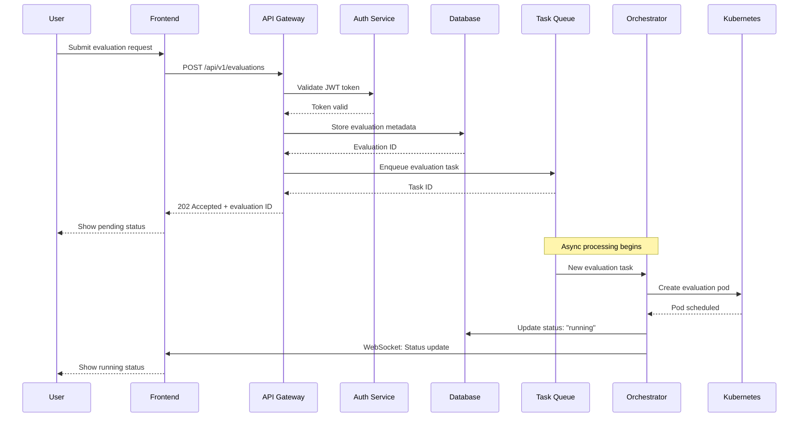
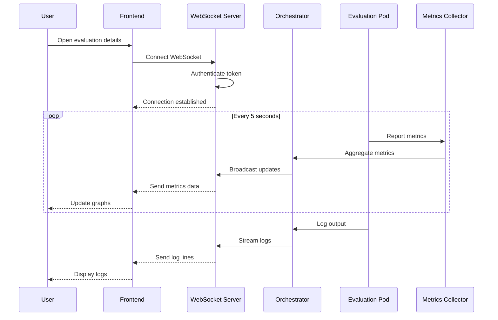
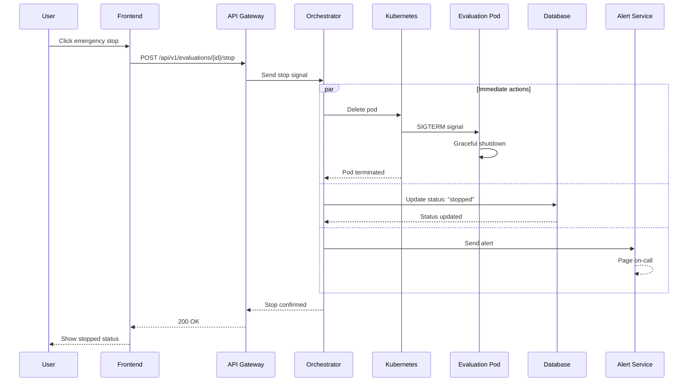
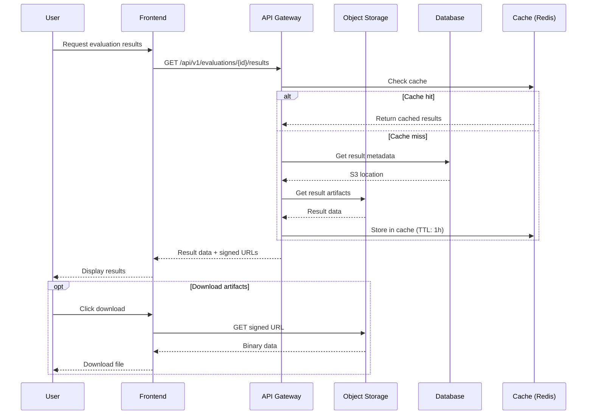
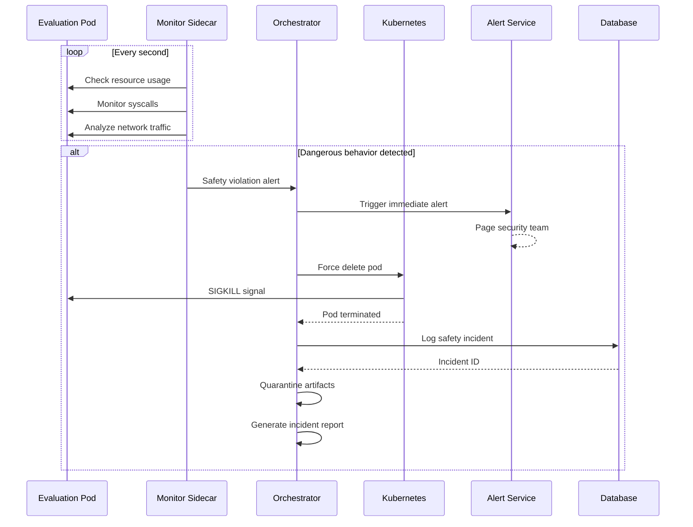
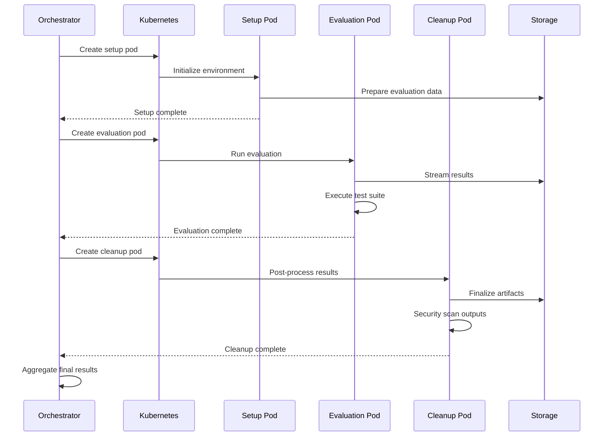
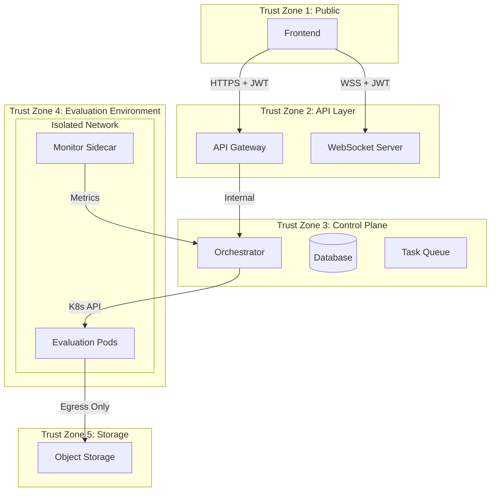

# Platform Architecture

## Executive Summary

This document details the architecture of the METR Model Evaluation Platform, a system designed to safely and efficiently evaluate AI models for potentially dangerous capabilities. The architecture prioritizes **security**, **scalability**, and **observability** while maintaining developer ergonomics.

### Key Design Principles
1. **Defense in Depth**: Multiple layers of security to prevent model escape
2. **Fail-Safe Defaults**: System fails closed, not open
3. **Observability First**: Every action is logged and monitored
4. **Horizontal Scalability**: Can handle 10 to 10,000 concurrent evaluations
5. **Developer Experience**: Simple APIs despite complex internals

> 🤔 **Quick Check**: Which principle would be most important when evaluating a model that might attempt network access? Why?

<details>
<summary>💡 Answer</summary>

Defense in Depth would be most critical. A model attempting network access could try to exfiltrate data, download additional capabilities, or communicate with external servers. Multiple security layers (network policies, firewall rules, egress monitoring) ensure that even if one control fails, others prevent escape.
</details>

## System Design

```
┌─────────────────────────────────────────────────────────────┐
│                     METR Evaluation Platform                │
├─────────────────────────────────────────────────────────────┤
│                                                             │
│  ┌─────────────┐    ┌──────────────-┐    ┌───────────────┐  │
│  │   Frontend  │────│   API Gateway │────│  Auth Service │  │
│  │  TypeScript │    │    (FastAPI)  │    │    (OAuth2)   │  │
│  └─────────────┘    └───────┬───────┘    └───────────────┘  │
│                             │                               │
│  ┌──────────────────────────┴─────────────────────────--┐   │
│  │              Evaluation Orchestrator                 │   │
│  │  ┌─────────┐  ┌────────────┐  ┌─────────────────┐    │   │
│  │  │Scheduler│  │ Task Queue │  │ Result Processor│    │   │
│  │  │         │  │  (Celery)  │  │                 │    │   │
│  │  └─────────┘  └────────────┘  └─────────────────┘    │   │
│  └─────────────────────┬─────────────────────────────---┘   │
│                        │                                    │
│  ┌─────────────────────┴──────────────────────────────--┐   │
│  │            Kubernetes Cluster (EKS/GKE)              │   │
│  │  ┌────────────┐  ┌────────────┐  ┌──────────────┐    │   │
│  │  │ Eval Pods  │  │ Monitoring │  │   Storage    │    │   │
│  │  │ (Isolated) │  │ Prometheus │  │   (S3/GCS)   │    │   │
│  │  └────────────┘  └────────────┘  └──────────────┘    │   │
│  └────────────────────────────────────────────────────-─┘   │
│                                                             │
└─────────────────────────────────────────────────────────────┘
```

## Component Details

> 📝 **Interview Prep**: Before reading each component section, try to list 3 things you'd expect to see in that component's design. Compare with what's actually built.

### 1. Frontend Dashboard

#### What We're Building
A real-time monitoring dashboard that provides visibility into ongoing AI model evaluations, resource usage, and safety alerts. This is the primary interface for researchers and safety engineers to track evaluation progress.

**Technology Stack**:
- **React 18**: Latest React for concurrent features and suspense
- **TypeScript 4.9+**: Type safety and better IDE support
- **Material-UI v5**: Consistent, accessible component library
- **Redux Toolkit**: State management with RTK Query for API calls
- **Socket.io Client**: WebSocket connection for real-time updates
- **Recharts**: Data visualization for metrics

**Core Features**:
1. **Real-time Evaluation Status**
   - Live progress bars for running evaluations
   - Color-coded status indicators (pending/running/success/failed/safety-stopped)
   - Streaming logs with filtering capabilities
   
2. **Resource Utilization Graphs**
   - CPU/Memory/GPU usage per evaluation
   - Cluster-wide resource allocation
   - Historical trends and capacity planning
   
3. **Safety Alert Notifications**
   - Real-time alerts for suspicious behavior
   - Capability detection warnings
   - Automatic evaluation termination controls
   
4. **Evaluation History and Analytics**
   - Searchable evaluation archive
   - Success/failure rates by model type
   - Performance benchmarks over time

#### Why This Approach

**Business Requirements Addressed**:
- **Visibility**: Researchers need to monitor long-running evaluations
- **Safety**: Immediate alerts for dangerous model behavior
- **Debugging**: Access to logs and metrics for failed evaluations
- **Planning**: Historical data for resource allocation

**Technical Benefits**:
1. **React + TypeScript**: Industry standard, large talent pool, excellent tooling
2. **Material-UI**: Reduces development time, ensures accessibility
3. **WebSockets**: Low-latency updates critical for safety monitoring
4. **Redux Toolkit**: Simplified state management with caching

---
**🎯 Self-Assessment Questions:**
- [ ] Can you explain why WebSockets are better than polling for this use case?
- [ ] What would happen if 10,000 clients connected simultaneously?
- [ ] How would you implement authentication for WebSocket connections?
---

#### Alternatives Considered

1. **Vue.js + Vuetify**
   - Pros: Simpler learning curve, excellent documentation
   - Cons: Smaller ecosystem, less TypeScript maturity
   - Decision: React's larger community better for long-term maintenance

2. **Next.js (Full-Stack)**
   - Pros: SSR/SSG capabilities, API routes included
   - Cons: Overhead for a monitoring dashboard, deployment complexity
   - Decision: Pure SPA sufficient for internal tool

3. **Svelte/SvelteKit**
   - Pros: Excellent performance, small bundle size
   - Cons: Smaller community, fewer experienced developers
   - Decision: Team expertise more important than performance gains

4. **Plain JavaScript + Web Components**
   - Pros: No framework lock-in, native browser features
   - Cons: More boilerplate, less developer productivity
   - Decision: Framework benefits outweigh flexibility

#### Implementation Details

**Key Architecture Patterns**:

```typescript
// Feature-based folder structure
frontend/
├── src/
│   ├── features/
│   │   ├── evaluations/
│   │   │   ├── components/
│   │   │   ├── hooks/
│   │   │   ├── services/
│   │   │   └── slice.ts
│   │   ├── monitoring/
│   │   └── alerts/
│   ├── shared/
│   │   ├── components/
│   │   ├── hooks/
│   │   └── utils/
│   └── app/
│       ├── store.ts
│       └── App.tsx
```

**WebSocket Integration**:
```typescript
// Real-time updates using Socket.io
const useEvaluationUpdates = (evaluationId: string) => {
  useEffect(() => {
    socket.on(`evaluation:${evaluationId}:update`, (data) => {
      dispatch(updateEvaluation(data));
    });
    
    return () => socket.off(`evaluation:${evaluationId}:update`);
  }, [evaluationId]);
};
```

**Performance Optimizations**:
- Virtual scrolling for large log outputs
- Memoization of expensive computations
- Lazy loading of historical data
- Service Worker for offline capability

#### Trade-offs & Limitations

**What We're Giving Up**:
1. **SEO**: SPA means no search engine optimization (acceptable for internal tool)
2. **Initial Load Time**: Larger bundle than server-rendered apps
3. **Complexity**: State management adds cognitive overhead

**Scaling Limits**:
- WebSocket connections limited by server memory (~10k concurrent)
- Browser performance degrades with >1000 real-time updates/second
- Local storage limited to 10MB for offline features

> 💭 **Scenario**: Your manager says "A major AI lab wants to use our platform and expects 50,000 concurrent users monitoring evaluations. How do we scale the frontend?"
> 
> *Think about: CDN strategies, WebSocket scaling, state management, caching layers, read replicas...*
> 
> <details>
> <summary>📋 Possible Solutions</summary>
> 
> 1. **WebSocket Scaling**: Implement Socket.io with Redis adapter for horizontal scaling across multiple servers
> 2. **CDN**: Use CloudFront/Fastly for static assets globally
> 3. **Edge Computing**: Deploy read-only dashboards to edge locations
> 4. **Pagination/Virtualization**: Limit real-time updates to visible evaluations only
> 5. **GraphQL Subscriptions**: More efficient than REST for selective field updates
> 6. **Event Sourcing**: Use Kafka/Kinesis for event distribution instead of direct WebSocket
> </details>

**Cost Implications**:
- Requires CDN for global distribution ($100-500/month)
- WebSocket servers need sticky sessions (load balancer complexity)

#### Interview Talking Points

**Questions to Expect**:
1. "Why React over other frameworks?"
   - Emphasize ecosystem, TypeScript support, team familiarity
   - Mention specific libraries that accelerated development

2. "How do you handle real-time updates at scale?"
   - Discuss WebSocket connection pooling
   - Mention fallback to long-polling for reliability
   - Explain client-side throttling/debouncing

3. "What about mobile/responsive design?"
   - Material-UI's responsive grid system
   - Progressive Web App capabilities
   - Touch-optimized interactions

**Related Topics to Know**:
- React 18's concurrent features (Suspense, startTransition)
- WebSocket scaling patterns (horizontal scaling with Redis)
- Browser performance profiling
- Accessibility standards (WCAG 2.1)

#### Learning Resources

**Official Documentation**:
- [React Beta Docs](https://react.dev/) - New official React documentation
- [TypeScript Handbook](https://www.typescriptlang.org/docs/)
- [Material-UI Documentation](https://mui.com/)

**Recommended Courses**:
- "Epic React" by Kent C. Dodds - Deep dive into React patterns
- "TypeScript Fundamentals" on Frontend Masters

**Key Articles**:
- ["Scaling WebSockets"](https://blog.actioncable.io/scaling-websockets) - Architecture patterns
- ["Real-time Dashboard Best Practices"](https://www.datadoghq.com/blog/real-time-dashboard-best-practices/)

### 2. API Gateway

#### What We're Building
A high-performance, async API gateway that serves as the single entry point for all platform interactions. It handles authentication, request routing, rate limiting, and provides both REST and WebSocket endpoints.

**Technology Stack**:
- **FastAPI**: Modern Python web framework with automatic OpenAPI docs
- **Python 3.11**: Latest Python with performance improvements
- **Pydantic V2**: Data validation with 17x performance boost
- **SQLAlchemy 2.0**: Async ORM for database operations
- **Redis**: Session storage and caching
- **Celery**: Distributed task queue for async operations

**Core Endpoints**:

```python
# Evaluation Management
POST   /api/v1/evaluations          # Submit new evaluation
GET    /api/v1/evaluations          # List evaluations (paginated)
GET    /api/v1/evaluations/{id}     # Get evaluation details
DELETE /api/v1/evaluations/{id}     # Cancel evaluation
POST   /api/v1/evaluations/{id}/stop # Emergency stop

# Real-time Monitoring
WS     /ws/evaluations/{id}         # WebSocket for live updates
GET    /api/v1/metrics              # Prometheus metrics
GET    /api/v1/health               # Health check

# Results & Artifacts
GET    /api/v1/evaluations/{id}/logs      # Streaming logs
GET    /api/v1/evaluations/{id}/results   # Final results
GET    /api/v1/evaluations/{id}/artifacts # Download artifacts
```

#### Why This Approach

**Business Requirements Addressed**:
- **Performance**: Handle 1000+ concurrent evaluation submissions
- **Developer Experience**: Auto-generated API docs and client SDKs
- **Security**: Built-in OAuth2 support and request validation
- **Flexibility**: Easy to add new endpoints as requirements evolve

**Technical Benefits**:
1. **FastAPI Advantages**:
   - Automatic OpenAPI/Swagger documentation
   - Built on Starlette (high performance ASGI)
   - Native async/await support
   - Type hints for validation and IDE support
   
2. **Python 3.11 Benefits**:
   - 10-60% faster than 3.10
   - Better error messages
   - Exception groups for concurrent operations
   
3. **Architecture Benefits**:
   - Clear separation of concerns
   - Easy to test with dependency injection
   - Horizontal scaling with load balancer

#### Alternatives Considered

1. **Django + Django REST Framework**
   - Pros: Mature, batteries-included, excellent ORM
   - Cons: Synchronous by default, heavier weight
   - Decision: FastAPI's native async support critical for high concurrency

2. **Flask + Flask-RESTful**
   - Pros: Simple, lightweight, flexible
   - Cons: Requires many extensions, less performant
   - Decision: FastAPI provides more out-of-box with better performance

3. **Go + Gin/Echo**
   - Pros: Excellent performance, single binary deployment
   - Cons: Less Python expertise on team, harder integration with ML tools
   - Decision: Python ecosystem benefits outweigh performance gains

4. **Node.js + Express**
   - Pros: Same language as frontend, huge ecosystem
   - Cons: Less suitable for CPU-intensive operations
   - Decision: Python better for data processing and ML integration

#### Implementation Details

**Project Structure**:
```python
src/api/
├── main.py              # FastAPI app initialization
├── config.py            # Settings with Pydantic
├── dependencies.py      # Shared dependencies
├── middleware/
│   ├── auth.py         # JWT/OAuth2 authentication
│   ├── ratelimit.py    # Rate limiting with Redis
│   └── logging.py      # Structured logging
├── routers/
│   ├── evaluations.py  # Evaluation endpoints
│   ├── metrics.py      # Monitoring endpoints
│   └── websocket.py    # WebSocket handlers
├── models/
│   ├── database.py     # SQLAlchemy models
│   └── schemas.py      # Pydantic schemas
├── services/
│   ├── evaluation.py   # Business logic
│   ├── orchestrator.py # Kubernetes integration
│   └── storage.py      # S3/GCS operations
└── utils/
    ├── security.py     # Encryption, hashing
    └── validators.py   # Custom validators
```

**Key Implementation Patterns**:

```python
# Dependency injection for testing
async def get_evaluation_service(
    db: AsyncSession = Depends(get_db),
    cache: Redis = Depends(get_redis),
    k8s: K8sClient = Depends(get_k8s_client)
) -> EvaluationService:
    return EvaluationService(db, cache, k8s)

# Async endpoint with validation
@router.post("/evaluations", response_model=EvaluationResponse)
async def create_evaluation(
    request: EvaluationRequest,
    service: EvaluationService = Depends(get_evaluation_service),
    current_user: User = Depends(get_current_user)
) -> EvaluationResponse:
    # Pydantic validates request automatically
    evaluation = await service.create_evaluation(
        request=request,
        user_id=current_user.id
    )
    # Background task for long-running operation
    background_tasks.add_task(
        service.start_evaluation,
        evaluation_id=evaluation.id
    )
    return evaluation

# WebSocket with authentication
@router.websocket("/ws/evaluations/{evaluation_id}")
async def evaluation_updates(
    websocket: WebSocket,
    evaluation_id: str,
    token: str = Query(...)
):
    user = await verify_websocket_token(token)
    await websocket.accept()
    
    async with subscription_manager.subscribe(evaluation_id) as subscription:
        async for update in subscription:
            await websocket.send_json(update)
```

**Performance Optimizations**:
- Connection pooling for database
- Redis caching with TTL
- Async I/O for all external calls
- Request/response compression
- ETags for conditional requests

#### Trade-offs & Limitations

**What We're Giving Up**:
1. **Backwards Compatibility**: FastAPI is newer, less battle-tested than Django
2. **Ecosystem**: Smaller ecosystem compared to older frameworks
3. **Complexity**: Async programming has a learning curve

**Scaling Limits**:
- Single instance handles ~5000 req/sec
- Database connection pool limits concurrent operations
- Redis memory limits cache size

**Cost Implications**:
- Requires Redis cluster for HA ($200+/month)
- Multiple API instances for redundancy
- Load balancer costs

#### Interview Talking Points

**Questions to Expect**:

1. "Why FastAPI over Django/Flask?"
   - Performance: Built on Starlette/Uvicorn
   - Developer experience: Auto docs, type validation
   - Modern: Designed for async, microservices

2. "How do you handle authentication?"
   - JWT tokens with refresh rotation
   - OAuth2 for third-party integration
   - API keys for service-to-service

3. "How do you ensure API reliability?"
   - Circuit breakers for external services
   - Retry logic with exponential backoff
   - Health checks and graceful shutdown
   - Rate limiting per user/IP

4. "How do you handle API versioning?"
   - URL versioning (/api/v1/, /api/v2/)
   - Deprecation headers
   - Backwards compatibility period

**Advanced Topics to Discuss**:
- OpenAPI schema generation and client SDK generation
- GraphQL vs REST trade-offs
- gRPC for internal services
- API Gateway patterns (Kong, Envoy)

#### Learning Resources

**Essential Reading**:
- [FastAPI Documentation](https://fastapi.tiangolo.com/) - Excellent tutorial
- [Async Python](https://realpython.com/async-io-python/) - Understanding async/await
- [API Design Patterns](https://www.oreilly.com/library/view/api-design-patterns/9781617295850/) - Best practices

**Courses**:
- "Test-Driven Development with FastAPI and Docker" on TestDriven.io
- "Microservices with FastAPI" on Udemy

**Production Examples**:
- [Netflix's API Gateway](https://netflixtechblog.com/optimizing-the-netflix-api-5c9ac715cf19)
- [Uber's API Design](https://eng.uber.com/api-design-guide/)

### 3. Evaluation Orchestrator
- **Scheduler**: Manages evaluation queue and priorities
- **Task Queue**: Celery with Redis backend
- **Result Processor**: Aggregates and analyzes results

### 4. Kubernetes Infrastructure
- **Evaluation Pods**: 
  - gVisor runtime for sandboxing
  - Resource limits (CPU, Memory, GPU)
  - Network policies for isolation
- **Monitoring**: Prometheus + Grafana stack
- **Storage**: Object storage for artifacts

## Security Architecture

### Network Isolation
```yaml
# Example NetworkPolicy
apiVersion: networking.k8s.io/v1
kind: NetworkPolicy
metadata:
  name: eval-pod-isolation
spec:
  podSelector:
    matchLabels:
      role: evaluation
  policyTypes:
  - Ingress
  - Egress
  ingress:
  - from:
    - podSelector:
        matchLabels:
          role: orchestrator
  egress:
  - to:
    - podSelector:
        matchLabels:
          role: storage
```

### Container Security
- Rootless containers
- Read-only root filesystem
- No privileged escalation
- Seccomp profiles

## Data Flow

1. **Evaluation Submission**
   - User submits via Frontend/API
   - Request validated and queued
   - Kubernetes pod scheduled

2. **Evaluation Execution**
   - Model loaded in isolated environment
   - Test suite executed with monitoring
   - Results streamed to storage

3. **Result Processing**
   - Raw results aggregated
   - Safety checks performed
   - Notifications sent if needed

## Scalability Considerations

- Horizontal pod autoscaling for evaluation workloads
- Cluster autoscaling for node pools
- Multi-region deployment capability
- CDN for static assets

## Monitoring & Observability

- **Metrics**: Prometheus with custom exporters
- **Logging**: Fluentd → Elasticsearch → Kibana
- **Tracing**: OpenTelemetry with Jaeger
- **Alerts**: PagerDuty integration

## Component Interaction Sequences

### 1. Evaluation Submission Flow



### 2. Real-time Monitoring Updates



### 3. Emergency Stop Procedure



### 4. Result Retrieval Flow



### 5. Safety Detection and Auto-Termination



### 6. Multi-Stage Evaluation Pipeline



## Component Communication Matrix

| From Component | To Component | Protocol | Auth Method | Purpose |
|----------------|--------------|----------|-------------|---------|
| Frontend | API Gateway | HTTPS/REST | JWT Bearer | CRUD operations |
| Frontend | WebSocket Server | WSS | JWT Query Param | Real-time updates |
| API Gateway | Database | TCP/5432 | mTLS | Data persistence |
| API Gateway | Task Queue | TCP/6379 | Redis AUTH | Job scheduling |
| Orchestrator | Kubernetes API | HTTPS | Service Account | Pod management |
| Eval Pods | Storage | HTTPS | IAM Role | Artifact upload |
| Monitor | Prometheus | HTTP/9090 | None (internal) | Metrics scraping |
| All Services | Alert Service | HTTPS | API Key | Incident reporting |

## Security Boundaries



## Interview Discussion Points

### When explaining these sequences:

1. **Emphasize Security**: Point out authentication at each step, isolation boundaries
2. **Highlight Scalability**: Mention how async patterns and queuing enable scale
3. **Discuss Failure Modes**: What happens when each component fails
4. **Show Monitoring**: Explain how we track each interaction
5. **Consider Extensions**: How would you add new features to these flows?

### Common Follow-up Questions:

**Q: "What if the WebSocket connection drops during monitoring?"**
A: Implement reconnection with exponential backoff, queue missed updates, replay on reconnect

**Q: "How do you prevent evaluation pods from accessing the internet?"**
A: Network policies with explicit egress rules, DNS filtering, transparent proxy for monitoring

**Q: "What happens if the orchestrator crashes mid-evaluation?"**
A: Leader election for HA, evaluation state in database, pods continue running with monitoring

**Q: "How do you handle large result artifacts?"**
A: Multipart upload to S3, streaming downloads, pagination for result listings