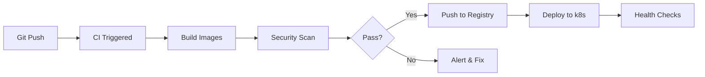

# Docker Container Documentation

This directory contains Docker configurations for the METR Model Evaluation Platform. Each Dockerfile is extensively documented to explain design decisions, security considerations, and optimization strategies.

## Overview

We use Docker for:
1. **Consistent Environments**: Reproducible builds across development, staging, and production
2. **Security Isolation**: Containers provide process and filesystem isolation
3. **Resource Management**: CPU, memory, and I/O limits per container
4. **Easy Deployment**: Single artifact that runs anywhere

## Container Architecture

```
docker/
├── Dockerfile.evaluator     # Secure sandbox for running model evaluations
├── Dockerfile.api          # API gateway service
├── Dockerfile.frontend     # React dashboard (nginx-based)
├── Dockerfile.orchestrator # Evaluation scheduler and queue manager
└── docker-compose.yml      # Local development orchestration
```

## Design Principles

1. **Minimal Attack Surface**: Use distroless or slim base images
2. **Non-Root Users**: Never run processes as root
3. **Multi-Stage Builds**: Separate build and runtime dependencies
4. **Layer Caching**: Optimize for fast rebuilds
5. **Security Scanning**: Integrate with Trivy/Snyk

---

## Dockerfile.evaluator - Secure Model Evaluation Environment

### What We're Building

A highly secure container for executing potentially dangerous AI model evaluations. This is the most critical security component - if a model escapes this container, it could compromise the entire system.

### Complete Dockerfile with Documentation

```dockerfile
# =============================================================================
# STAGE 1: Builder Stage
# Purpose: Compile dependencies and prepare virtual environment
# Why multi-stage: Reduces final image size by ~60% and removes build tools
# =============================================================================
FROM python:3.11-slim as builder

# Install build dependencies
# Note: We need gcc/g++ for packages with C extensions (numpy, scikit-learn)
# git is required for pip installing from git repositories
RUN apt-get update && apt-get install -y \
    gcc \
    g++ \
    git \
    && rm -rf /var/lib/apt/lists/*

# Create virtual environment
# Why venv: Isolates dependencies, makes them portable between stages
RUN python -m venv /opt/venv
ENV PATH="/opt/venv/bin:$PATH"

# Copy only requirements first (Docker layer caching optimization)
# This means if code changes but requirements don't, this layer is cached
COPY requirements/evaluator.txt /tmp/requirements.txt

# Install dependencies with specific flags:
# --no-cache-dir: Reduces image size by not storing pip cache
# --no-deps for some packages: Prevents dependency conflicts
RUN pip install --no-cache-dir -r /tmp/requirements.txt

# =============================================================================
# STAGE 2: Runtime Stage  
# Purpose: Minimal runtime environment for security and size
# Base image: python:3.11-slim (Debian-based, ~150MB vs 900MB for full)
# =============================================================================
FROM python:3.11-slim

# Security: Create non-root user
# UID 1000 is convention for first non-root user
# Why: Prevents container escape to root, limits damage from exploits
RUN useradd -m -u 1000 -s /bin/bash evaluator

# Copy virtual environment from builder
# --from=builder: References previous stage
# This brings in only the installed packages, not build tools
COPY --from=builder /opt/venv /opt/venv

# Environment variables for Python and evaluation limits
ENV PATH="/opt/venv/bin:$PATH" \
    PYTHONUNBUFFERED=1 \
    PYTHONDONTWRITEBYTECODE=1 \
    EVAL_TIMEOUT=3600 \
    MAX_MEMORY_MB=8192

# Create required directories with proper permissions
# /app/evaluations: Where evaluation scripts are copied
# /app/logs: Evaluation logs (read by monitoring)
# /app/results: Output artifacts
RUN mkdir -p /app/evaluations /app/logs /app/results && \
    chown -R evaluator:evaluator /app

WORKDIR /app

# Copy application code with correct ownership
# --chown: Sets ownership during copy (more efficient than separate chown)
COPY --chown=evaluator:evaluator src/evaluator /app/evaluator
COPY --chown=evaluator:evaluator src/utils /app/utils

# Security hardening: Set strict file permissions
# 755 for directories: owner rwx, others r-x (need execute to enter dirs)
# 644 for Python files: owner rw-, others r-- (no execute needed for Python)
RUN chmod -R 755 /app && \
    find /app -type f -name "*.py" -exec chmod 644 {} \;

# Switch to non-root user (critical security measure)
USER evaluator

# Health check: Ensures container is responsive
# --interval: Check every 30s
# --timeout: Fail if check takes >10s  
# --start-period: Grace period during startup
# --retries: Mark unhealthy after 3 failures
HEALTHCHECK --interval=30s --timeout=10s --start-period=5s --retries=3 \
    CMD python -c "import sys; sys.exit(0)"

# Entry point: Use exec form for proper signal handling
# This ensures Python receives SIGTERM for graceful shutdown
ENTRYPOINT ["python", "-m", "evaluator.main"]
```

### Why This Approach

**Security Requirements Addressed**:
1. **Process Isolation**: Non-root user prevents privilege escalation
2. **Filesystem Protection**: Read-only Python files prevent code injection
3. **Resource Limits**: Environment variables set hard limits
4. **Minimal Attack Surface**: Slim base image with only required packages

**Performance Benefits**:
1. **Small Image Size**: ~200MB vs ~1GB for full Python image
2. **Fast Startup**: No unnecessary services or packages
3. **Layer Caching**: Requirements rarely change, so builds are fast
4. **Memory Efficiency**: Shared base layers across containers

### Alternatives Considered

1. **Alpine Linux Base**
   ```dockerfile
   FROM python:3.11-alpine
   ```
   - Pros: Even smaller (~50MB base), uses musl libc
   - Cons: Compatibility issues with some Python packages, slower builds
   - Decision: Debian slim better for compatibility with scientific Python packages

2. **Distroless Images**
   ```dockerfile
   FROM gcr.io/distroless/python3-debian11
   ```
   - Pros: Ultimate security - no shell, no package manager
   - Cons: Hard to debug, limited Python package support
   - Decision: Too restrictive for development, consider for production

3. **Ubuntu Base**
   ```dockerfile
   FROM ubuntu:22.04
   ```
   - Pros: Familiar, well-documented, good driver support
   - Cons: Larger size, more attack surface
   - Decision: Unnecessary overhead for our use case

4. **Custom Scratch Image**
   ```dockerfile
   FROM scratch
   COPY --from=builder / /
   ```
   - Pros: Absolute minimal size, complete control
   - Cons: Extremely complex, no standard libraries
   - Decision: Not worth the complexity for marginal gains

> 🤔 **Quick Check**: Why do we use multi-stage builds instead of a single stage?

<details>
<summary>💡 Answer</summary>

Multi-stage builds serve three purposes:
1. **Size Reduction**: Build tools (gcc, git) aren't in final image (-60% size)
2. **Security**: Compilers and build tools are common attack vectors
3. **Layer Optimization**: Source code changes don't invalidate dependency layers

Example size comparison:
- Single stage: ~800MB
- Multi-stage: ~200MB
</details>

### Security Deep Dive

#### 1. User Permissions Strategy
```dockerfile
# Why UID 1000?
RUN useradd -m -u 1000 -s /bin/bash evaluator
```

- Standard UID for first non-root user
- Consistent across environments
- Maps correctly to host user in development
- Prevents UID conflicts in Kubernetes

#### 2. File Permission Model
```bash
# Directory permissions: 755 (rwxr-xr-x)
# - Owner: Read, Write, Execute
# - Others: Read, Execute (need X to traverse)

# Python files: 644 (rw-r--r--)  
# - Owner: Read, Write
# - Others: Read only
# - No execute bit (Python interpreter handles execution)
```

#### 3. Runtime Security Features

**What's Disabled**:
- No sudo/su binaries
- No setuid/setgid programs
- No package managers
- No compiler toolchain
- No shell for distroless variants

**What's Enabled**:
- Read-only root filesystem (via Kubernetes)
- No new privileges flag
- Seccomp profiles
- AppArmor/SELinux policies
- Network policies

---
**🎯 Self-Assessment Questions:**
- [ ] What happens if an attacker gains code execution in this container?
- [ ] How would you add GPU support while maintaining security?
- [ ] What additional hardening would you add for production?
---

### Performance Optimizations

1. **Layer Caching Strategy**
   ```dockerfile
   # Order matters! Most stable → most volatile
   COPY requirements.txt  # Changes rarely
   RUN pip install       # Cached if requirements unchanged
   COPY src/             # Changes frequently
   ```

2. **Build Time Optimizations**
   - Use BuildKit: `DOCKER_BUILDKIT=1`
   - Parallel stage building
   - Cache mount for pip: `--mount=type=cache,target=/root/.cache/pip`

3. **Runtime Optimizations**
   - Slim base image reduces memory usage
   - No unnecessary processes or services
   - Python optimizations via environment variables

### Monitoring & Debugging

Despite security restrictions, we need observability:

1. **Structured Logging**
   ```python
   # All logs go to stdout/stderr for collection
   logging.basicConfig(
       format='%(asctime)s %(levelname)s %(message)s',
       level=logging.INFO,
       handlers=[logging.StreamHandler()]
   )
   ```

2. **Debug Mode**
   ```dockerfile
   # Development version with debugging tools
   FROM evaluator:base as debug
   USER root
   RUN apt-get update && apt-get install -y \
       strace \
       tcpdump \
       vim
   USER evaluator
   ```

3. **Health Checks**
   - Liveness: Process is running
   - Readiness: Can accept evaluations
   - Custom metrics: Prometheus endpoint

### Interview Talking Points

**Common Questions**:

1. **"Why not just use root and be careful?"**
   - Defense in depth principle
   - Compliance requirements (SOC2, ISO 27001)
   - Limits blast radius of container escape
   - Industry best practice

2. **"How do you handle secrets in containers?"**
   - Never bake into image
   - Mount from Kubernetes secrets
   - Use init containers for secret retrieval
   - Consider HashiCorp Vault integration

3. **"What about container scanning?"**
   ```bash
   # Integrated into CI/CD
   trivy image evaluator:latest
   snyk container test evaluator:latest
   ```

4. **"How do you update base images?"**
   - Automated PRs via Dependabot
   - Weekly rebuilds for security patches
   - Staged rollout with canary deployments

> 💭 **Scenario**: A security audit reveals that an attacker could potentially use Python's `eval()` function to escape the container. How would you prevent this while still allowing legitimate model evaluation?

<details>
<summary>📋 Possible Solutions</summary>

1. **Python Sandboxing**: Use RestrictedPython or custom AST parsing
2. **System Call Filtering**: Seccomp profiles to block dangerous syscalls
3. **Runtime Security**: Falco rules to detect anomalous behavior
4. **Code Analysis**: Static analysis to detect dangerous patterns
5. **Separate Processes**: Run evaluations in even more isolated processes
6. **Hardware Isolation**: Consider gVisor or Kata Containers
</details>

### Learning Resources

**Container Security**:
- [NIST Container Security Guide](https://nvlpubs.nist.gov/nistpubs/SpecialPublications/NIST.SP.800-190.pdf)
- [CIS Docker Benchmark](https://www.cisecurity.org/benchmark/docker)
- [OWASP Container Security Top 10](https://owasp.org/www-project-docker-top-10/)

**Python in Containers**:
- [Python Docker Best Practices](https://pythonspeed.com/docker/)
- [Multi-stage Builds Deep Dive](https://docs.docker.com/develop/develop-images/multistage-build/)

**Advanced Topics**:
- Container runtime security (gVisor, Firecracker)
- Rootless containers
- Distroless images
- Supply chain security (SBOM, signing)

---

## Dockerfile.api - API Gateway Container

### What We're Building

A high-performance container for the FastAPI-based API gateway that handles all external requests, authentication, and routing to internal services.

### Complete Dockerfile with Documentation

```dockerfile
# =============================================================================
# API Gateway Dockerfile
# Purpose: RESTful API + WebSocket server for platform interaction
# Security Level: Medium (exposed to network but not running user code)
# =============================================================================
FROM python:3.11-slim

# Install system dependencies
# curl: Required for health checks and debugging
# postgresql-client: For database migrations (optional)
RUN apt-get update && apt-get install -y \
    curl \
    && rm -rf /var/lib/apt/lists/*

# Create non-root user for API service
# Different UID (1001) to distinguish from evaluator service
RUN useradd -m -u 1001 -s /bin/bash api

# Set working directory early (helps with debugging)
WORKDIR /app

# Copy and install requirements
# Separate from code for layer caching
COPY requirements/api.txt /app/requirements.txt

# Install Python dependencies as root (for system packages)
# Then switch to non-root user
RUN pip install --no-cache-dir -r requirements.txt

# Copy application code with correct ownership
# Note: We copy after pip install for better caching
COPY --chown=api:api src/api /app/api
COPY --chown=api:api src/utils /app/utils

# Create necessary directories for runtime
# logs: Application logs (consider external volume)
# temp: Temporary file uploads
RUN mkdir -p /app/logs /app/temp && \
    chown -R api:api /app/logs /app/temp

# Environment variables for configuration
# These can be overridden at runtime
ENV PYTHONUNBUFFERED=1 \
    API_HOST=0.0.0.0 \
    API_PORT=8000 \
    API_WORKERS=4 \
    LOG_LEVEL=INFO

# Switch to non-root user
USER api

# Expose port (documentation only, doesn't actually open ports)
EXPOSE 8000

# Health check using curl to hit health endpoint
# More realistic than Python check for API service
HEALTHCHECK --interval=30s --timeout=10s --start-period=5s --retries=3 \
    CMD curl -f http://localhost:8000/health || exit 1

# Run with Uvicorn in production mode
# --host 0.0.0.0: Listen on all interfaces (needed for container)
# --port 8000: Standard port for internal services
# --workers 4: Multiple workers for concurrency (adjust based on CPU)
# Note: In k8s, you might want single worker and scale pods instead
CMD ["uvicorn", "api.main:app", "--host", "0.0.0.0", "--port", "8000", "--workers", "4"]

# =============================================================================
# Alternative: Production-optimized version with Gunicorn
# =============================================================================
# For production, consider Gunicorn with Uvicorn workers:
# 
# CMD ["gunicorn", "api.main:app", \
#      "--workers", "4", \
#      "--worker-class", "uvicorn.workers.UvicornWorker", \
#      "--bind", "0.0.0.0:8000", \
#      "--access-logfile", "-", \
#      "--error-logfile", "-"]
```

### Why This Approach

**Requirements Addressed**:
1. **Performance**: Uvicorn ASGI server for async Python
2. **Scalability**: Multiple workers for CPU-bound operations  
3. **Security**: Non-root user, minimal attack surface
4. **Observability**: Health checks and structured logging
5. **Developer Experience**: Fast rebuilds, clear configuration

**Design Decisions**:

1. **Why Uvicorn over Gunicorn?**
   - Pure async performance
   - Simpler configuration
   - Built for FastAPI
   - Lower memory usage

2. **Why 4 workers?**
   - General rule: 2-4 x CPU cores
   - Balance memory vs concurrency
   - In k8s, often better to use 1 worker and scale pods

3. **Why include curl?**
   - Realistic health checks
   - Debugging capability
   - Small size impact (~5MB)

### Alternatives Considered

1. **Alpine Base**
   ```dockerfile
   FROM python:3.11-alpine
   RUN apk add --no-cache curl
   ```
   - Pros: Smaller size (50MB saved)
   - Cons: Slower pip installs, musl libc issues
   - Decision: Reliability > size for API service

2. **Distroless Python**
   ```dockerfile
   FROM gcr.io/distroless/python3
   ```
   - Pros: Maximum security
   - Cons: No shell for debugging, complex health checks
   - Decision: Too restrictive for API debugging needs

3. **Two-Stage Build**
   ```dockerfile
   FROM python:3.11 as builder
   # ... install deps ...
   FROM python:3.11-slim
   COPY --from=builder /usr/local /usr/local
   ```
   - Pros: Smaller final image
   - Cons: Complexity not worth it for pure Python
   - Decision: Single stage sufficient for API

> 🤔 **Design Challenge**: How would you modify this Dockerfile to support both HTTP/2 and WebSocket connections?

<details>
<summary>💡 Solution Approach</summary>

1. **Hypercorn Instead of Uvicorn**:
   ```dockerfile
   RUN pip install hypercorn[h2]
   CMD ["hypercorn", "api.main:app", "--bind", "0.0.0.0:8000", "--workers", "4"]
   ```

2. **Nginx Sidecar Pattern**:
   - Keep Uvicorn for Python
   - Add Nginx container for HTTP/2 termination
   - Link via localhost in pod

3. **Configuration Changes**:
   ```python
   # In FastAPI app
   app = FastAPI(
       openapi_url="/openapi.json",
       docs_url="/docs",
       redoc_url="/redoc",
       # Enable HTTP/2 Server Push
       server_push=True
   )
   ```
</details>

### Security Considerations

#### API-Specific Threats

1. **DDoS Protection**
   - Rate limiting in app
   - CloudFlare/WAF in front
   - Connection limits in load balancer

2. **Authentication Bypass**
   - JWT validation on every request
   - Token rotation strategy
   - Secure session storage

3. **Injection Attacks**
   - Input validation via Pydantic
   - Parameterized queries
   - Content-Type validation

#### Container Hardening

```dockerfile
# Additional security layers for production
FROM api:base as production

# Remove unnecessary binaries
RUN find / -type f -perm /4000 -exec rm -f {} \; 2>/dev/null || true

# Add security scanning
RUN pip install safety && \
    safety check

# Read-only root filesystem (set in k8s)
# Drop all capabilities (set in k8s)
# No new privileges (set in k8s)
```

---
**🎯 Self-Assessment Questions:**
- [ ] How would you handle graceful shutdown of in-flight requests?
- [ ] What's the difference between EXPOSE and actually opening a port?
- [ ] How would you implement zero-downtime deployments?
---

### Performance Tuning

1. **Worker Configuration**
   ```python
   # Dynamic based on CPU
   import multiprocessing
   workers = multiprocessing.cpu_count() * 2 + 1
   ```

2. **Memory Optimization**
   ```dockerfile
   # Limit Python memory usage
   ENV PYTHONMALLOC=malloc
   ENV MALLOC_TRIM_THRESHOLD_=100000
   ```

3. **Connection Pooling**
   ```python
   # In app startup
   app.state.db_pool = create_async_engine(
       DATABASE_URL,
       pool_size=20,
       max_overflow=0,
       pool_pre_ping=True,
   )
   ```

### Debugging & Monitoring

1. **Development Override**
   ```dockerfile
   # docker-compose.override.yml
   version: '3.8'
   services:
     api:
       image: api:debug
       environment:
         - LOG_LEVEL=DEBUG
       volumes:
         - ./src:/app/src  # Hot reload
       command: ["uvicorn", "api.main:app", "--reload"]
   ```

2. **Production Monitoring**
   - Prometheus metrics endpoint
   - Structured JSON logging
   - Distributed tracing headers
   - Error tracking (Sentry)

### Interview Talking Points

**Expected Questions**:

1. **"How do you handle API versioning in containers?"**
   - URL versioning (/v1/, /v2/)
   - Header versioning
   - Separate containers per version
   - Gradual migration strategy

2. **"What about secret management?"**
   - Never in Dockerfile or image
   - Kubernetes secrets as env vars
   - AWS Secrets Manager integration
   - HashiCorp Vault for rotation

3. **"How do you scale the API service?"**
   - Horizontal Pod Autoscaling
   - Load balancer configuration
   - Connection pooling
   - Caching strategy (Redis)

> 💭 **Scenario**: During a load test, you notice the API containers are using 2GB of memory each, far more than expected. How would you debug and fix this?

<details>
<summary>📋 Debugging Approach</summary>

1. **Memory Profiling**:
   ```python
   # Add memory profiler
   from memory_profiler import profile
   
   @profile
   def suspected_endpoint():
       pass
   ```

2. **Check for Leaks**:
   - Circular references
   - Global caches growing unbounded
   - Connection pool exhaustion

3. **Solutions**:
   - Limit worker lifetime: `--max-requests 1000`
   - Add memory limits in k8s
   - Use `tracemalloc` for detailed analysis
   - Consider switching to Rust for hot paths
</details>

### Next Steps & Advanced Topics

1. **Container Optimization**
   - Multi-arch builds (AMD64 + ARM64)
   - Build cache mounting
   - Minimal base images research

2. **Security Enhancements**
   - Runtime vulnerability scanning
   - Network policy enforcement
   - Service mesh integration (Istio)

3. **Performance Improvements**
   - JIT compilation with Nuitka
   - Cython for hot paths
   - Alternative ASGI servers

### Learning Resources

**FastAPI Deployment**:
- [FastAPI Deployment Guide](https://fastapi.tiangolo.com/deployment/)
- [Uvicorn Deployment](https://www.uvicorn.org/deployment/)
- [ASGI Server Comparison](https://github.com/florimondmanca/awesome-asgi)

**Container Patterns**:
- [12 Factor App](https://12factor.net/)
- [Container Best Practices](https://cloud.google.com/solutions/best-practices-for-building-containers)
- [Dockerfile Best Practices](https://docs.docker.com/develop/develop-images/dockerfile_best-practices/)

---

## Common Patterns Across All Dockerfiles

### 1. Non-Root User Pattern
```dockerfile
# Create user
RUN useradd -m -u <UID> -s /bin/bash <username>
# ... install dependencies as root ...
# Switch to user
USER <username>
```

### 2. Layer Caching Pattern
```dockerfile
# Most stable first
COPY requirements.txt .
RUN pip install -r requirements.txt
# Most volatile last
COPY src/ .
```

### 3. Security Hardening Pattern
```dockerfile
# Remove setuid binaries
RUN find / -perm /4000 -delete
# Remove package managers (distroless)
# Set read-only filesystem (k8s)
```

### 4. Multi-Stage Pattern
```dockerfile
FROM base as builder
# Build steps
FROM base as runtime
COPY --from=builder /artifacts /app
```

## Container Build & Deploy Pipeline



## Quick Reference

| Container | Base Image | Size | Security Level | Use Case |
|-----------|------------|------|----------------|----------|
| evaluator | python:3.11-slim | ~200MB | Maximum | Model evaluation |
| api | python:3.11-slim | ~250MB | High | External API |
| frontend | node:18-alpine + nginx | ~50MB | Medium | Static files |

---

## Dockerfile.frontend - React Dashboard with Nginx

### What We're Building

A production-optimized container for serving the React-based monitoring dashboard. This uses a multi-stage build to compile TypeScript/React in Node.js, then serves the static files with Nginx for optimal performance and security.

### Architecture Decision: Why Multi-Stage for Frontend?

The frontend requires two completely different environments:
1. **Build time**: Node.js, npm, TypeScript compiler, Webpack
2. **Runtime**: Just a web server to serve static files

Multi-stage builds let us use a heavy build environment (~1GB) but ship a tiny runtime (~50MB).

> 🤔 **Quick Check**: What security benefit do we get from not including Node.js in the final image?

<details>
<summary>💡 Answer</summary>

1. **No JavaScript runtime** = No code execution vulnerability
2. **No npm** = No supply chain attacks via malicious packages  
3. **No build tools** = Smaller attack surface
4. **Static files only** = Predictable security model
</details>

### Complete Dockerfile Analysis

Let's examine each section:

#### Build Stage Deep Dive

```dockerfile
FROM node:18-alpine as builder

# Why Alpine for build stage?
# - Smaller base image (150MB vs 900MB for full Node)
# - Faster downloads in CI/CD
# - musl libc is fine for build tools
# - APK package manager is fast

RUN apk add --no-cache python3 make g++ git
# Why these packages?
# - python3: Some npm packages use Python build scripts
# - make, g++: For node-gyp (compiles native modules)
# - git: For packages referenced by git URL
```

**Alternative Base Images Considered**:

1. **node:18 (Debian)**
   - Pros: Better compatibility, apt packages
   - Cons: 900MB base image, slower builds
   - Decision: Alpine sufficient for build stage

2. **node:18-slim**
   - Pros: Smaller than full Node (400MB)
   - Cons: Still includes unnecessary runtime
   - Decision: Alpine is even smaller

3. **Custom Node on Ubuntu**
   - Pros: Full control, specific versions
   - Cons: Maintenance burden
   - Decision: Official images are well-maintained

#### Dependency Installation Strategy

```dockerfile
WORKDIR /app
COPY frontend/package*.json ./
RUN npm ci --frozen-lockfile
```

**Why This Order?**
1. Dependencies change less than source code
2. Docker caches this layer if package*.json unchanged
3. Rebuilds are faster when only source changes

**npm ci vs npm install**:
- `ci`: Faster, deterministic, requires lock file
- `install`: Can update lock file, slower
- Decision: `ci` for reproducible builds

---
**🎯 Self-Assessment Questions:**
- [ ] What happens if package-lock.json is missing?
- [ ] How would you handle private npm registries?
- [ ] When would you use npm install instead of npm ci?
---

#### Build Process Optimization

```dockerfile
COPY frontend/tsconfig.json ./
COPY frontend/public/ ./public/
COPY frontend/src/ ./src/
RUN npm run build
```

**Build Optimizations in package.json**:
```json
{
  "scripts": {
    "build": "GENERATE_SOURCEMAP=false react-scripts build",
    "build:analyze": "source-map-explorer 'build/static/js/*.js'"
  }
}
```

**What Happens During Build?**
1. TypeScript → JavaScript transpilation
2. JSX → React.createElement calls
3. Module bundling with Webpack
4. Tree shaking (dead code elimination)
5. Minification and uglification
6. Asset optimization (images, fonts)
7. Code splitting for lazy loading
8. HTML/CSS/JS injection

> 💭 **Scenario**: The build takes 10 minutes in CI/CD. How would you optimize it?

<details>
<summary>📋 Optimization Strategies</summary>

1. **Layer Caching**: Ensure package*.json hasn't changed
2. **Build Cache Mount**: 
   ```dockerfile
   RUN --mount=type=cache,target=/app/.npm \
       npm ci --cache /app/.npm
   ```
3. **Parallel Builds**: Use `concurrent` for multiple builds
4. **Webpack Cache**: Enable persistent caching
5. **Smaller Source**: Exclude unnecessary files
6. **Build Machine**: Use larger CI/CD instances
7. **Consider Vite**: Faster alternative to Create React App
</details>

#### Runtime Stage Analysis

```dockerfile
FROM nginx:1.24-alpine

# Why Nginx?
# - Industry standard for static files
# - Excellent performance (C-based)
# - Rich feature set (caching, compression, security)
# - Small memory footprint
# - Battle-tested in production
```

**Alternative Web Servers Considered**:

1. **Apache httpd**
   - Pros: More features, .htaccess support
   - Cons: Higher memory usage, slower for static files
   - Decision: Nginx better for containers

2. **Caddy**
   - Pros: Automatic HTTPS, simple config
   - Cons: Less mature, Go-based (different expertise)
   - Decision: Nginx more proven at scale

3. **Node.js + Express**
   - Pros: Same language as build
   - Cons: Inefficient for static files, security risk
   - Decision: Wrong tool for the job

4. **Python SimpleHTTPServer**
   - Pros: Minimal, built-in
   - Cons: Not production-ready, no features
   - Decision: Only for development

### Nginx Configuration Deep Dive

#### Security Headers Explained

```nginx
# Prevent clickjacking attacks
add_header X-Frame-Options "SAMEORIGIN" always;

# Prevent MIME type sniffing
add_header X-Content-Type-Options "nosniff" always;

# Enable XSS protection in older browsers
add_header X-XSS-Protection "1; mode=block" always;

# Control referrer information
add_header Referrer-Policy "strict-origin-when-cross-origin" always;

# Content Security Policy - the big one
add_header Content-Security-Policy "default-src 'self'; ..." always;
```

**CSP Breakdown**:
- `default-src 'self'`: Only load resources from same origin
- `script-src 'self' 'unsafe-inline'`: Allow inline scripts (React needs this)
- `connect-src 'self' ws: wss:`: Allow WebSocket connections
- `img-src 'self' data: https:`: Allow images from HTTPS and data URIs

> 🤔 **Design Challenge**: How would you modify the CSP to be stricter while still supporting React?

<details>
<summary>💡 Stricter CSP Approach</summary>

1. **Remove 'unsafe-inline'**: Use nonces or hashes
2. **Webpack Plugin**: 
   ```javascript
   new CspHtmlWebpackPlugin({
     'script-src': ["'self'", "'nonce-{random}'"],
     'style-src': ["'self'", "'nonce-{random}'"]
   })
   ```
3. **Runtime Nonce**: Pass nonce to React
4. **Strict-Dynamic**: Modern CSP approach
5. **Report-Only Mode**: Test before enforcing
</details>

#### Caching Strategy

```nginx
# Static assets - cache forever
location ~* \.(jpg|jpeg|png|gif|ico|css|js|svg|woff|woff2)$ {
    expires 1y;
    add_header Cache-Control "public, immutable";
}

# HTML files - never cache
location / {
    add_header Cache-Control "no-cache, no-store, must-revalidate";
}

# Service worker - special handling
location /service-worker.js {
    add_header Cache-Control "no-store";
}
```

**Why This Strategy?**
1. **Static assets**: Webpack adds hash to filenames, safe to cache forever
2. **HTML**: Contains references to assets, must stay fresh
3. **Service Worker**: Can control entire app, must stay fresh

#### SPA Routing Magic

```nginx
location / {
    try_files $uri $uri/ /index.html;
}
```

**What This Does**:
1. Try to serve the exact file requested
2. Try to serve directory index
3. Fall back to index.html (React Router handles routing)

**Common SPA Issues This Solves**:
- Direct links to routes work (`/dashboard/evaluation/123`)
- Refresh doesn't give 404
- SEO crawlers get content

### Performance Optimizations

#### 1. Gzip Compression
```nginx
gzip on;
gzip_comp_level 6;  # Balance CPU vs compression
gzip_types text/plain text/css application/json application/javascript;
```

**Impact**: 70-90% reduction in transfer size

#### 2. HTTP/2 Support
```nginx
listen 443 ssl http2;  # In production with TLS
```

**Benefits**: Multiplexing, server push, header compression

#### 3. Brotli Compression
```dockerfile
# Add Brotli module to Nginx
FROM nginx:1.24-alpine
RUN apk add --no-cache nginx-mod-http-brotli
```

**Impact**: 20-30% better than gzip

---
**🎯 Self-Assessment Questions:**
- [ ] How would you implement cache busting for deployments?
- [ ] What's the security implication of `try_files`?
- [ ] How would you add HTTP/3 support?
---

### Container Security Hardening

#### Runtime User Configuration
```dockerfile
RUN adduser -D -H -u 1002 -s /sbin/nologin nginx-user
```

**Flags Explained**:
- `-D`: No password
- `-H`: No home directory  
- `-u 1002`: Specific UID
- `-s /sbin/nologin`: Can't login

**Note**: Nginx master still runs as root (needs port 80), but workers run as nginx-user

#### Read-Only Filesystem
```yaml
# In Kubernetes deployment
securityContext:
  readOnlyRootFilesystem: true
  runAsNonRoot: false  # Master needs root
  runAsUser: 0  # But workers drop privileges
```

**Required Volume Mounts**:
```yaml
volumes:
- name: cache
  emptyDir: {}
- name: run
  emptyDir: {}
volumeMounts:
- name: cache
  mountPath: /var/cache/nginx
- name: run  
  mountPath: /var/run
```

### Debugging & Troubleshooting

#### Common Issues and Solutions

1. **"nginx: [emerg] mkdir() failed"**
   - Cause: Read-only filesystem
   - Solution: Mount writable volumes

2. **"403 Forbidden on all routes"**
   - Cause: Wrong file permissions
   - Solution: Check nginx-user owns files

3. **"WebSocket connection failed"**
   - Cause: Missing upgrade headers
   - Solution: Check proxy configuration

4. **"Slow initial page load"**
   - Cause: Large bundle size
   - Solution: Code splitting, lazy loading

#### Debug Container
```dockerfile
# Development version with debugging tools
FROM frontend:production as debug
USER root
RUN apk add --no-cache \
    vim \
    curl \
    net-tools \
    nginx-mod-http-echo
COPY docker/nginx-debug.conf /etc/nginx/nginx.conf
```

### Production Deployment Considerations

#### 1. TLS Termination
```nginx
server {
    listen 443 ssl http2;
    ssl_certificate /etc/nginx/ssl/cert.pem;
    ssl_certificate_key /etc/nginx/ssl/key.pem;
    ssl_protocols TLSv1.2 TLSv1.3;
    ssl_ciphers HIGH:!aNULL:!MD5;
}
```

#### 2. CDN Integration
- CloudFront for global distribution
- Respect cache headers
- Geographic routing

#### 3. Monitoring
```nginx
location /nginx-status {
    stub_status on;
    access_log off;
    allow 10.0.0.0/8;  # Only from internal network
    deny all;
}
```

### Interview Talking Points

**Expected Questions**:

1. **"Why Nginx over serving from Node.js?"**
   - Performance: Nginx is optimized for static files
   - Security: No JavaScript runtime in production
   - Features: Built-in caching, compression, rate limiting
   - Separation: Clear boundary between build and serve

2. **"How do you handle API versioning in the frontend?"**
   - Environment variables at build time
   - Runtime configuration via window.CONFIG
   - Feature flags for gradual rollout
   - Multiple builds for different versions

3. **"What about SEO for a SPA?"**
   - Server-side rendering with Next.js
   - Pre-rendering with react-snap
   - Dynamic rendering for crawlers
   - Structured data in index.html

> 💭 **Scenario**: Users in Asia complain about slow load times. The app is hosted in US-East. How would you solve this?

<details>
<summary>📋 Global Performance Strategy</summary>

1. **CDN Distribution**:
   - CloudFront or Fastly
   - Cache static assets at edge
   - Geographic routing

2. **Regional Deployments**:
   - Deploy to multiple regions
   - Route users to nearest region
   - Sync data between regions

3. **Optimize Bundle**:
   - Code splitting by route
   - Lazy load heavy components
   - Tree shake unused code

4. **Progressive Enhancement**:
   - App shell architecture  
   - Service worker for offline
   - Skeleton screens while loading

5. **Performance Budget**:
   - Max 200KB JavaScript
   - Sub-3s time to interactive
   - Lighthouse CI in pipeline
</details>

### Advanced Topics

#### 1. Micro-Frontends
```nginx
# Route to different frontend apps
location /dashboard {
    proxy_pass http://dashboard-frontend;
}
location /admin {
    proxy_pass http://admin-frontend;
}
```

#### 2. A/B Testing
```nginx
# Split traffic between versions
split_clients "${remote_addr}${http_user_agent}" $frontend_version {
    50% "v1";
    50% "v2";
}
location / {
    proxy_pass http://frontend-$frontend_version;
}
```

#### 3. Security Scanning
```bash
# In CI/CD pipeline
docker build -t frontend:latest .
trivy image frontend:latest
docker run --rm -v $PWD:/src \
  aquasec/trivy config /src/docker/nginx.conf
```

### Learning Resources

**Frontend Container Optimization**:
- [High Performance Browser Networking](https://hpbn.co/)
- [Nginx Optimization Guide](https://www.nginx.com/blog/tuning-nginx/)
- [Web.dev Performance](https://web.dev/performance/)

**Security**:
- [OWASP Top 10 for Containers](https://owasp.org/www-project-docker-top-10/)
- [Mozilla Security Headers](https://infosec.mozilla.org/guidelines/web_security)
- [CSP Evaluator](https://csp-evaluator.withgoogle.com/)

**React Production**:
- [React Production Deployment](https://create-react-app.dev/docs/deployment/)
- [Webpack Optimization](https://webpack.js.org/guides/production/)
- [Bundle Analysis](https://www.npmjs.com/package/webpack-bundle-analyzer)
| orchestrator | python:3.11-slim | ~300MB | High | Job scheduling |

## Next Steps

1. Review each Dockerfile in detail
2. Understand the security implications
3. Practice building and debugging containers
4. Learn Kubernetes deployment patterns
5. Study container runtime security