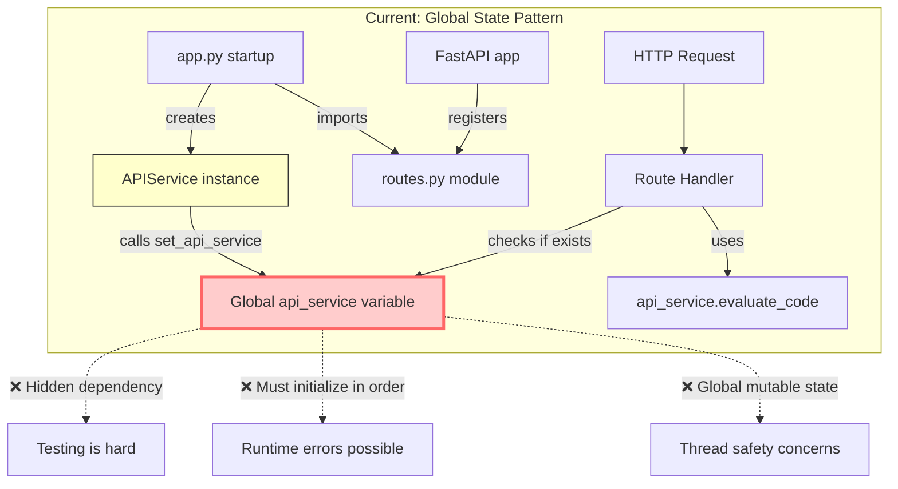
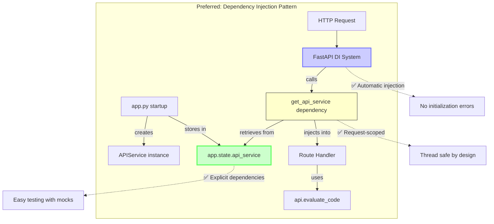

# Dependency Injection Architecture Comparison

## Current Architecture (Global State)



### Current Code Flow:
```python
# 1. app.py creates service
api_service = create_api_service(platform)

# 2. routes.py has global
api_service: Optional[APIService] = None

# 3. app.py must remember to call
set_api_service(api_service)

# 4. Routes use global directly
if not api_service:
    raise HTTPException(503, "Not initialized")
api_service.evaluate_code(code)
```

## Preferred Architecture (Dependency Injection)



### Preferred Code Flow:
```python
# 1. app.py stores in app state
app = FastAPI()
app.state.api_service = create_api_service(platform)

# 2. Dependency function
async def get_api_service(request: Request) -> APIService:
    return request.app.state.api_service

# 3. Routes declare dependencies
async def create_evaluation(
    request: EvaluationCreate,
    api: APIService = Depends(get_api_service),  # ✅ Explicit!
    db: AsyncSession = Depends(get_db)          # ✅ Consistent!
):
    result = await api.evaluate_code(request.code)
```

## Key Differences

| Aspect | Current (Global) | Preferred (DI) |
|--------|-----------------|----------------|
| **Dependencies** | Hidden in function body | Explicit in function signature |
| **Testing** | Must patch global | Pass mock as parameter |
| **Initialization** | Manual, order-dependent | Automatic by framework |
| **Error Handling** | Runtime check for None | Framework ensures it exists |
| **Code Clarity** | `if not api_service:` checks | Clean business logic |
| **Scalability** | Single global instance | Can be per-request if needed |

## Testing Example

### Current (Difficult):
```python
# Must patch the global
def test_create_evaluation():
    with patch('api.routes.api_service') as mock_api:
        mock_api.evaluate_code.return_value = {...}
        # Test code
```

### Preferred (Easy):
```python
# Just pass a mock
def test_create_evaluation():
    mock_api = Mock()
    mock_api.evaluate_code.return_value = {...}
    
    # Directly call with mock
    result = await create_evaluation(
        request=EvaluationCreate(code="test"),
        api=mock_api,  # ✅ Direct injection!
        db=mock_db
    )
```

## Migration Path

To move from current to preferred:

1. **Add app.state storage**:
   ```python
   # In app.py or server startup
   app.state.api_service = api_service
   ```

2. **Create dependency function**:
   ```python
   def get_api_service(request: Request) -> APIService:
       return request.app.state.api_service
   ```

3. **Update routes one by one**:
   ```python
   # Change from hidden global to explicit parameter
   api: APIService = Depends(get_api_service)
   ```

4. **Remove global and setter**:
   ```python
   # Delete these lines
   # api_service: Optional[APIService] = None
   # def set_api_service(service: APIService): ...
   ```

This makes the code more maintainable, testable, and follows FastAPI best practices!