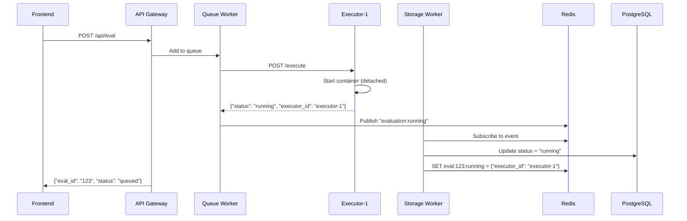
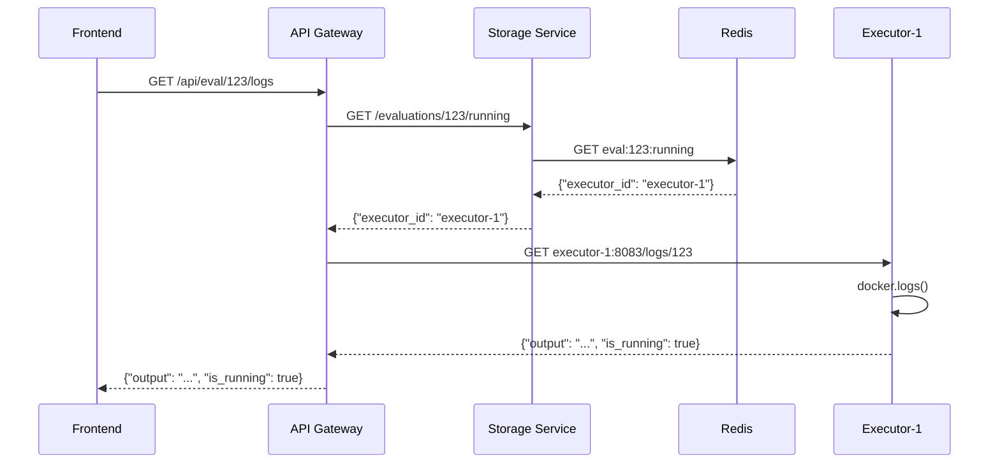
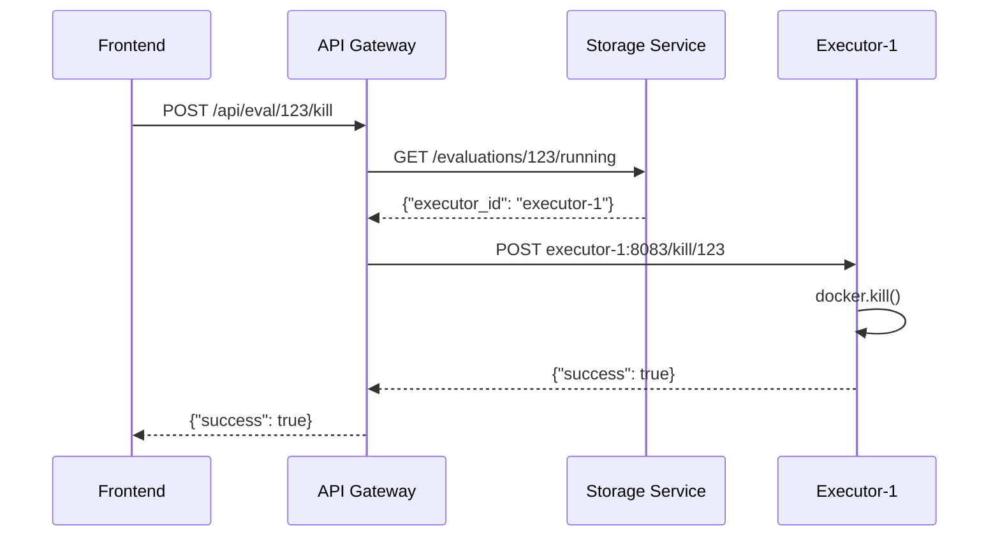

# Real-Time Execution Tracking Architecture

## Overview

This document describes how the platform tracks running containers and provides real-time log streaming. The design maintains a 1:1 relationship between executors and containers, preparing for eventual Kubernetes migration.

## Design Principles

1. **1:1 Executor-Container Mapping**: Each executor service can only run one container at a time
2. **Storage Service as Single Source of Truth**: All data access goes through storage service
3. **Hybrid Storage Strategy**: PostgreSQL for persistent data, Redis for transient operational state
4. **Prepare for Kubernetes**: Design mirrors how Kubernetes Jobs/Pods would work

## Data Architecture

### Storage Types by Purpose

| Data Type | Storage | TTL | Example |
|-----------|---------|-----|---------|
| Evaluation metadata | PostgreSQL | Permanent | Code, status, final output |
| Running container info | Redis | ~2 minutes | Executor assignment, container ID |
| Large outputs | File System | Permanent | Outputs >100KB |
| Cache | Redis | Variable | Frequently accessed evaluations |

### Redis Data Structures

```python
# Running container information
"eval:{eval_id}:running" = {
    "executor_id": "executor-1",      # Which executor owns this container
    "container_id": "abc123def456",   # Docker container ID
    "started_at": "2024-01-15T10:30:00Z",
    "timeout": 30
}
# TTL: timeout + buffer (e.g., 60 seconds)

# Set of all running evaluations
"running_evaluations" = ["eval_123", "eval_456"]  # Redis SET
```

## Component Responsibilities

### Queue Worker
- Selects available executor (round-robin with health checks)
- Sends evaluation to executor
- Publishes "evaluation:running" event with executor assignment
- **Exits after receiving "running" status** (fire-and-forget pattern)

### Executor Service
- Enforces 1:1 container limit
- Starts containers in detached mode
- Provides endpoints:
  - `POST /execute` - Start container (returns immediately)
  - `GET /logs/{eval_id}` - Stream current logs
  - `POST /kill/{eval_id}` - Kill running container
  - `GET /running` - List running containers on this executor

### Storage Worker
- Subscribes to evaluation events
- Updates PostgreSQL status
- **Stores transient executor mapping in Redis**
- Maintains running evaluations set

### Storage Service
- Single source of truth for all data
- New endpoint: `GET /evaluations/{eval_id}/running`
  - Checks Redis for executor assignment
  - Returns 404 if not running
  - Returns executor_id and container_id if running

### API Gateway
- Orchestrates multi-service operations
- For log streaming:
  1. Queries storage service for executor assignment
  2. Proxies request to correct executor
  3. Returns logs to frontend

## Flow Sequences

### Starting an Evaluation



### Streaming Logs



### Killing a Container



## Implementation Details

### Storage Worker: Handling Running Event

```python
async def handle_evaluation_running(self, data: Dict[str, Any]):
    """Handle evaluation running event"""
    eval_id = data.get('eval_id')
    executor_id = data.get('executor_id')
    container_id = data.get('container_id')
    
    # Update PostgreSQL status
    response = await self.client.put(
        f"{self.storage_url}/evaluations/{eval_id}",
        json={"status": EvaluationStatus.RUNNING.value}
    )
    
    # Store transient executor info in Redis
    running_info = {
        "executor_id": executor_id,
        "container_id": container_id,
        "started_at": datetime.utcnow().isoformat(),
        "timeout": data.get('timeout', 30)
    }
    
    ttl = data.get('timeout', 30) + 60  # timeout + buffer
    await self.redis.setex(
        f"eval:{eval_id}:running",
        ttl,
        json.dumps(running_info)
    )
    
    # Track in running set
    await self.redis.sadd("running_evaluations", eval_id)
```

### Storage Service: New Endpoint

```python
@app.get("/evaluations/{eval_id}/running")
async def get_running_info(eval_id: str):
    """Get running container info from Redis"""
    try:
        # Check Redis for transient running info
        running_data = await redis.get(f"eval:{eval_id}:running")
        if not running_data:
            raise HTTPException(404, "Evaluation not running")
            
        return json.loads(running_data)
    except Exception as e:
        logger.error(f"Error getting running info: {e}")
        raise HTTPException(500, str(e))
```

### API Gateway: Log Streaming

```python
@app.get("/api/eval/{eval_id}/logs")
async def get_evaluation_logs(eval_id: str):
    # Step 1: Get executor assignment from storage service
    try:
        response = await storage_client.get(
            f"{STORAGE_SERVICE_URL}/evaluations/{eval_id}/running"
        )
        running_info = response.json()
    except httpx.HTTPStatusError as e:
        if e.response.status_code == 404:
            return JSONResponse(
                {"error": "Evaluation not running"}, 
                status_code=404
            )
        raise
    
    # Step 2: Get logs from assigned executor
    executor_id = running_info["executor_id"]
    executor_url = f"http://{executor_id}:8083"
    
    try:
        logs_response = await httpx.get(f"{executor_url}/logs/{eval_id}")
        return logs_response.json()
    except Exception as e:
        return JSONResponse(
            {"error": f"Failed to get logs: {str(e)}"}, 
            status_code=500
        )
```

## Kubernetes Migration Path

This design prepares for Kubernetes by mimicking its patterns:

| Docker Compose | Kubernetes Equivalent |
|----------------|---------------------|
| Executor service | Node (runs pods) |
| Container | Pod/Job |
| Queue worker assigns to executor | Scheduler assigns to node |
| Redis tracks executor assignment | Kubernetes API tracks pod location |
| Query executor for logs | `kubectl logs pod-name` |
| Kill container | `kubectl delete pod` |

In Kubernetes, the queue worker would:
```python
# Instead of calling executor service
job = create_job_manifest(eval_id, code)
k8s_client.create_namespaced_job(namespace="evaluations", body=job)

# Kubernetes handles:
# - Scheduling to a node
# - Starting the container
# - Tracking which node runs it
```

## Benefits of This Design

1. **Clean Separation**: Storage service owns all data, executors own containers
2. **Scalable**: Add more executors by adding services to docker-compose
3. **Fault Tolerant**: Redis TTL cleans up stale mappings automatically
4. **Observable**: Can query running evaluations across all executors
5. **Kubernetes Ready**: Mirrors K8s patterns for easier migration

## Frontend Integration

The frontend can now:
1. Poll `/api/eval/{eval_id}` to get current status
2. If status is "running", enable log streaming UI
3. Poll `/api/eval/{eval_id}/logs` for real-time output
4. Show kill button that calls `/api/eval/{eval_id}/kill`
5. List all running evaluations via `/api/evaluations?status=running`

## Security Considerations

1. **Executor Isolation**: Each executor runs in Docker-in-Docker with socket proxy
2. **Resource Limits**: 1 container per executor prevents resource exhaustion  
3. **Network Isolation**: Containers run with `network_mode=none`
4. **Automatic Cleanup**: Timeouts and TTLs prevent resource leaks