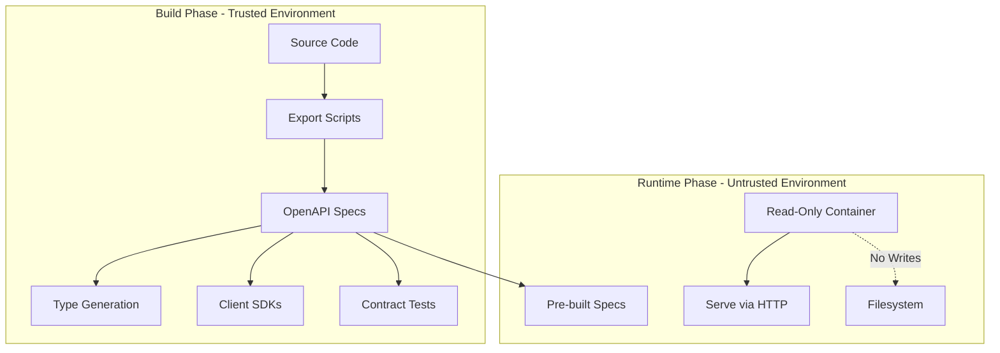

# OpenAPI Generation Security Analysis

## Executive Summary

This document analyzes various OpenAPI generation approaches for a security-focused platform with read-only container requirements. The analysis reveals that **build-time export scripts** provide the optimal balance between security and functionality.

## Core Requirements

### Security Requirements
- **Read-only containers** in production (security best practice)
- **Minimal filesystem writes** to reduce attack surface
- **No runtime generation** to prevent exploitation

### Functional Requirements  
- **Build-time availability** for type generation
- **Service-to-service contracts** for type safety
- **CI/CD integration** for automated validation
- **Version control** for API evolution tracking

## The Fundamental Constraint

OpenAPI specs must be available at **build time** for:
- Frontend TypeScript type generation
- Service client SDK generation
- API contract validation in CI/CD
- Documentation generation

This eliminates any purely runtime approach from consideration.

## Approach Analysis

### 1. Build-Time Export Scripts ✅ **SELECTED APPROACH**

**How it works:**
```bash
# CI/CD build phase
python api/scripts/export-openapi-spec.py
python storage-service/scripts/export-openapi-spec.py
python executor-service/scripts/export-openapi-spec.py
```

**Security Profile:**
- ✅ No runtime filesystem writes
- ✅ Read-only containers fully supported
- ✅ Generation only in trusted CI/CD environment
- ✅ Specs committed to version control

**Build-Time Availability:** ✅ AVAILABLE
- Specs exist in repository before deployment
- All services can access during their build phase

**Why Selected:** Optimal balance - provides build-time availability with zero runtime writes.

### 2. In-Memory Runtime Generation ❌

**How it works:**
```python
@app.on_event("startup")
async def setup_openapi():
    app.openapi_schema = get_openapi(...)  # Memory only
```

**Security Profile:**
- ✅ Zero filesystem writes
- ✅ Perfect runtime security

**Build-Time Availability:** ❌ NOT AVAILABLE
- Specs only exist when service is running
- Cannot generate types during build
- Cannot validate contracts in CI/CD

**Why Rejected:** Fails the fundamental requirement of build-time availability.

### 3. External Storage (S3/Database/Redis) ❌

**How it works:**
```python
@app.on_event("startup")
async def export_to_s3():
    spec = app.openapi()
    await s3_client.put_object(...)
```

**Security Profile:**
- ✅ No local filesystem writes
- ⚠️ Requires runtime credentials
- ⚠️ Network exposure

**Build-Time Availability:** ❌ PARTIALLY AVAILABLE
- Requires services to be deployed first
- Circular dependency: need specs to build, need deployment for specs
- Complex CI/CD orchestration needed

**Why Rejected:** Creates deployment complexity and circular dependencies.

### 4. Writable Volume Mount ❌

**How it works:**
```yaml
volumes:
  - type: tmpfs
    target: /app/specs
readOnlyRootFilesystem: true
```

**Security Profile:**
- ❌ Breaks read-only container principle
- ❌ Increases attack surface
- ❌ Potential for malicious writes

**Build-Time Availability:** ❌ NOT AVAILABLE
- Volumes are runtime constructs
- Specs lost on container restart

**Why Rejected:** Violates security requirements and doesn't provide build-time access.

### 5. Init Container Pattern ⚠️

**How it works:**
```yaml
initContainers:
  - name: generate-specs
    command: ["python", "export-openapi-spec.py"]
```

**Security Profile:**
- ✅ Main container stays read-only
- ⚠️ Init container needs write access
- ⚠️ Shared volume concerns

**Build-Time Availability:** ❌ NOT AVAILABLE
- Init containers run at pod startup, not build time
- Cannot access during CI/CD build phase

**Why Rejected:** Runtime-only solution, doesn't meet build-time needs.

### 6. Build-Time Baking ✅

**How it works:**
```dockerfile
RUN python scripts/export-openapi-spec.py
# Specs included in image
```

**Security Profile:**
- ✅ No runtime writes
- ✅ Immutable artifacts
- ✅ Excellent security

**Build-Time Availability:** ⚠️ PARTIALLY AVAILABLE
- Available after Docker build
- But services need each other's specs during their builds
- Complex build ordering required

**Why Not Selected:** While secure, creates complex inter-service build dependencies.

### 7. API Gateway Aggregation ❌

**How it works:**
- Central gateway fetches specs at runtime
- Aggregates and serves them

**Security Profile:**
- ✅ Services stay read-only
- ⚠️ Gateway needs storage/cache

**Build-Time Availability:** ❌ NOT AVAILABLE
- Gateway only runs at runtime
- Cannot provide specs during build

**Why Rejected:** Runtime-only solution.

### 8. No OpenAPI Specs ❌

**Security Profile:**
- ✅ No generation = no security concerns
- ✅ Minimal attack surface

**Build-Time Availability:** ❌ NO CONTRACTS
- Loses type safety
- No automated contract validation
- Manual coordination required

**Why Rejected:** Loses critical type safety and automation benefits.

### 9. Contract-First Development ⚠️

**How it works:**
- Write OpenAPI specs manually
- Generate code from specs

**Security Profile:**
- ✅ No runtime generation
- ✅ Specs in version control

**Build-Time Availability:** ✅ AVAILABLE
- Specs exist before code

**Why Not Selected:** High maintenance burden, specs drift from implementation.

### 10. Service Mesh Documentation ❌

**Security Profile:**
- ✅ No application writes
- ✅ Infrastructure handles it

**Build-Time Availability:** ❌ NOT AVAILABLE
- Mesh discovers APIs at runtime
- Cannot generate build-time types

**Why Rejected:** Runtime-only discovery.

## Security Architecture



## Implementation Decision

We selected **Build-Time Export Scripts** because it:

1. **Meets Security Requirements**
   - Zero runtime filesystem writes
   - Supports read-only containers
   - Minimal attack surface

2. **Provides Build-Time Availability**
   - Specs in version control
   - Available for type generation
   - Enables CI/CD validation

3. **Maintains Simplicity**
   - Straightforward implementation
   - No complex dependencies
   - Easy to understand and audit

## Security Best Practices

1. **Separation of Concerns**
   - Build environment: Can write, generate artifacts
   - Runtime environment: Read-only, serve only

2. **Principle of Least Privilege**
   - Production containers have no write permissions
   - Only CI/CD can modify specs

3. **Immutable Infrastructure**
   - Specs are versioned artifacts
   - Changes require new deployments
   - Full audit trail in git

## Conclusion

For security-critical platforms requiring read-only containers, build-time OpenAPI generation is the only approach that satisfies both security and functional requirements. The selected approach ensures type safety and contract validation while maintaining a minimal runtime attack surface.