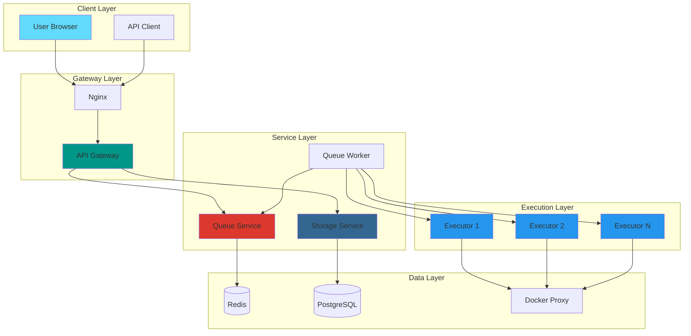
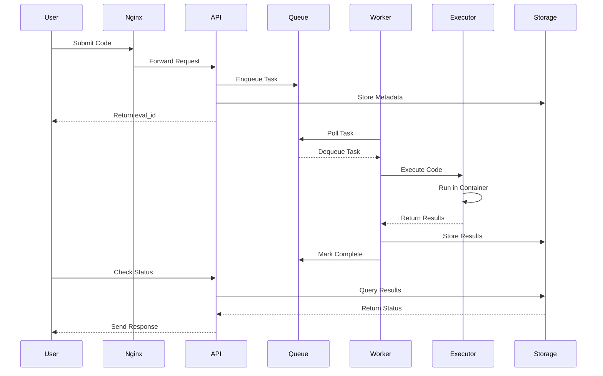

# Platform Architecture Overview

The Crucible Platform uses a microservices architecture designed for security, scalability, and observability.

## Core Components

### 1. API Gateway
The central entry point for all client requests. Handles:
- Request routing
- Authentication
- Rate limiting
- Response aggregation

### 2. Queue Service
Manages task distribution using Redis. Features:
- Priority queuing
- Task deduplication
- Dead letter queue handling
- Retry mechanisms

### 3. Storage Service
Persistent data layer using PostgreSQL. Stores:
- Evaluation metadata
- Execution results
- User data
- Audit logs

### 4. Executors
Isolated containers that run user code. Security features:
- Network isolation
- Resource limits
- Read-only filesystems
- Syscall filtering

## Architecture Diagram

## Request Flow

## Security Layers

### 1. Network Security
- **Nginx**: Rate limiting, DDoS protection
- **Internal network**: Service-to-service authentication
- **Egress control**: Executors have no internet access

### 2. Container Security
- **User namespaces**: Rootless containers
- **Seccomp profiles**: Syscall filtering
- **AppArmor**: Mandatory access control
- **Resource limits**: CPU, memory, disk

### 3. Application Security
- **Input validation**: All user input sanitized
- **Output encoding**: XSS prevention
- **Authentication**: JWT tokens with refresh
- **Authorization**: Role-based access control

## Scaling Strategy

### Horizontal Scaling
- **Executors**: Add more containers for parallel execution
- **Workers**: Scale based on queue depth
- **API Gateway**: Load balanced instances

### Vertical Scaling
- **Database**: Read replicas for query scaling
- **Redis**: Cluster mode for high throughput
- **Storage**: Sharded by evaluation ID

## Monitoring & Observability

### Metrics Collection
- **Prometheus**: Time-series metrics
- **Grafana**: Visualization dashboards
- **Custom metrics**: Queue depth, execution time

### Logging
- **Structured logs**: JSON format
- **Centralized collection**: ELK stack
- **Correlation IDs**: Request tracing

### Alerting
- **SLA monitoring**: Response time, availability
- **Resource alerts**: CPU, memory, disk
- **Security alerts**: Failed auth, suspicious activity

## Technology Stack

| Component | Technology | Why |
|-----------|------------|-----|
| API Gateway | FastAPI | Async Python, automatic OpenAPI docs |
| Queue | Redis | Fast, supports pub/sub and streams |
| Database | PostgreSQL | ACID compliance, JSON support |
| Containers | Docker | Industry standard, good tooling |
| Orchestration | Docker Compose / K8s | Local dev / Production |
| Frontend | React + TypeScript | Type safety, component reuse |
| Monitoring | Prometheus + Grafana | Open source, powerful queries |

## Design Principles

1. **Security First**: Every component assumes zero trust
2. **Fail Safe**: Graceful degradation, not cascading failures
3. **Observable**: Rich metrics and logging at every layer
4. **Simple**: Prefer boring technology that works
5. **Scalable**: Horizontal scaling preferred over vertical

## Next Steps

- [Microservices Design](/docs/architecture/microservices)
- [Security Model](/docs/architecture/security)
- [Event Architecture](/docs/architecture/events)