# Evolution of the Crucible Platform

This directory demonstrates the TRACE-AI methodology through iterative evolution of an AI evaluation platform.

## Quick Visual Summary

```mermaid
graph TD
    A[extreme_mvp.py<br/>156 lines - UNSAFE] --> B[Added Safety]
    A --> C[Added Testing]
    A --> D[Added Abstractions]
    
    B --> B1[extreme_mvp_docker.py<br/>Container isolation]
    B1 --> B2[extreme_mvp_docker_v2.py<br/>ExecutionEngine abstraction]
    B2 --> B3[extreme_mvp_gvisor.py<br/>Kernel isolation ⭐]
    
    C --> C1[extreme_mvp_testable.py<br/>TestableComponent base]
    C1 --> C2[*_testable.py variants<br/>Everything testable]
    
    D --> D1[extreme_mvp_abstracted.py<br/>Clean interfaces]
    D1 --> D2[extreme_mvp_modular.py<br/>Component separation ⭐]
    
    B2 --> E[Added Features]
    E --> E1[extreme_mvp_monitoring_*.py<br/>Visibility]
    E --> E2[extreme_mvp_queue*.py<br/>Concurrency]
    
    B2 --> D2
    C2 --> D2
    E1 --> D2
    E2 --> D2
    
    D2 --> F[components/<br/>Modular Architecture ⭐]
```



## Current Production-Ready Files

### 🌟 **extreme_mvp_modular.py** - Latest Architecture
- Imports from `components/` package
- Fully separated concerns
- Each component can evolve independently
- Ready for microservices transformation

### 🔒 **extreme_mvp_gvisor_modular.py** - Production Security + Modular Design
- Combines modular architecture with gVisor security
- Uses gVisor runtime for kernel-level isolation
- Achieves 4/4 safety requirements
- Production-grade security with clean architecture
- **This is the recommended version for production deployment**

### 📦 **components/** - Modular Components
- `base.py` - TestableComponent foundation
- `execution.py` - Execution engines (subprocess, Docker, future: K8s)
- `monitoring.py` - Event tracking (future: OpenTelemetry)
- `platform.py` - Orchestration (future: API service)
- `storage.py` - Data persistence (InMemory, File, future: S3/PostgreSQL)
- `queue.py` - Task queue management (future: Celery/RabbitMQ)

## Evolution Timeline

```
Day 1: extreme_mvp.py
      ↓ "This is terrifying! We need safety!"
Day 2: extreme_mvp_docker.py
      ↓ "We need abstractions!"
Day 3: extreme_mvp_docker_v2.py
      ↓ "We need visibility!" → monitoring branch
      ↓ "We need concurrency!" → queue branch
      ↓ "We need testing!" → testable variants
Day 4: extreme_mvp_modular.py + components/
      ↓ "We need production security!"
Day 5: extreme_mvp_gvisor.py
```

## Running the Examples

### Basic Modular Platform (Recommended)
```bash
# With Docker (safe)
python extreme_mvp_modular.py

# Without Docker (unsafe, development only)
python extreme_mvp_modular.py --unsafe
```

### Production Security (Best for Deployment)
```bash
# Uses modular architecture + gVisor security
python extreme_mvp_gvisor_modular.py
```

## Testing

We have a unified test runner that supports both component-level and integration testing:

```bash
# Default: Run all tests (recommended for CI/CD)
python test_components.py

# Test individual components
python test_components.py execution    # Test all execution engines
python test_components.py monitoring   # Test monitoring service
python test_components.py platform     # Test platform orchestration
python test_components.py storage      # Test storage service
python test_components.py queue        # Test task queue

# Test specific engine configurations
python test_components.py --docker     # Test with Docker only
python test_components.py --subprocess # Test with subprocess only  
python test_components.py --gvisor     # Test with gVisor only
```

### Future Testing Architecture

In a production microservices architecture, each component would have:
- Its own test suite in its repository
- Integration tests at service boundaries
- End-to-end tests across services

For now, our modular monolith uses `TestableComponent` to ensure every component can self-test and provide unittest suites.

## Key Learnings

1. **Start Simple**: 156 lines can demonstrate core value
2. **Identify Dangers Early**: Unsafe execution was immediately obvious
3. **Abstract Gradually**: Each abstraction solved a real problem
4. **Test Everything**: Safety-critical systems need comprehensive testing
5. **Modularize for Growth**: Components that can evolve independently

## What's Next?

Each component in `components/` can now evolve into:
- **execution.py** → Kubernetes Job orchestrator
- **monitoring.py** → OpenTelemetry integration
- **platform.py** → FastAPI REST service
- **base.py** → Distributed testing framework
- **storage.py** → S3/PostgreSQL with caching layer
- **queue.py** → Celery with RabbitMQ/Redis backend

## Cleanup Recommendation

```bash
# Create archive directory
mkdir -p archive

# Move obsolete files (keeping for education)
mv extreme_mvp_docker.py archive/
mv extreme_mvp_monitoring.py archive/
mv extreme_mvp_monitoring_v2.py archive/
mv extreme_mvp_queue.py archive/

# Keep these in main directory:
# - extreme_mvp.py (original - shows the danger)
# - extreme_mvp_modular.py (current architecture)
# - extreme_mvp_gvisor.py (production security)
# - extreme_mvp_testable.py (testing philosophy)
# - components/ (modular architecture)
```