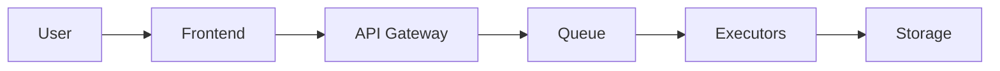

# Quick Start Guide

Get the Crucible Platform running locally in under 5 minutes.

## Prerequisites

- Docker Desktop installed and running
- Node.js 20+ (for local development)
- Git

## 1. Clone the Repository

```bash
git clone https://github.com/your-org/crucible-platform.git
cd crucible-platform
```

## 2. Start the Platform

```bash
docker compose up -d
```

This starts all services:
- API Gateway (port 80)
- Queue Service 
- Storage Service
- 2 Executors
- PostgreSQL
- Redis

## 3. Verify Installation

Open your browser to http://localhost

You should see the Crucible Platform interface.

## 4. Run Your First Evaluation

1. Click "Run Evaluation"
2. Paste this Python code:
   ```python
   print("Hello from Crucible!")
   for i in range(5):
       print(f"Count: {i}")
   ```
3. Click "Submit"
4. Watch the real-time output

## Architecture Overview



## Next Steps

- [Architecture Overview](/docs/architecture/platform-overview)
- [API Documentation](/docs/api/endpoints)
- [Security Model](/docs/security/containers)

## Troubleshooting

### Services not starting?
```bash
docker compose logs -f
```

### Port conflicts?
Check if port 80 is already in use:
```bash
lsof -i :80
```

### Need help?
- Check the [full documentation](/docs)
- Open an issue on GitHub