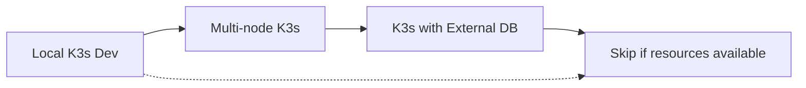

# Kubernetes vs K3s: Memory and Resource Comparison

## Overview

This document compares resource requirements between full Kubernetes (K8s) and K3s, explaining why we chose K3s for our single-node deployment.

## Memory Requirements Breakdown

### Full Kubernetes (kubeadm installation)

#### Control Plane Components
| Component | Memory Usage | Purpose |
|-----------|--------------|---------|
| kube-apiserver | 250-500 MB | API server, handles all API requests |
| etcd | 150-300 MB | Distributed key-value store for cluster state |
| kube-controller-manager | 100-200 MB | Runs controller loops (deployments, replicasets, etc.) |
| kube-scheduler | 50-100 MB | Assigns pods to nodes |
| **Total Control Plane** | **800-1200 MB** | **Minimum for HA: 1.5 GB** |

#### Worker Node Components
| Component | Memory Usage | Purpose |
|-----------|--------------|---------|
| kubelet | 100-200 MB | Node agent, manages pods |
| kube-proxy | 50-100 MB | Network proxy, implements services |
| Container runtime | 100-200 MB | Docker/containerd |
| **Total Node** | **250-500 MB** | **Per worker node** |

#### Single Node Full K8s
- Control Plane: ~1 GB
- Node Components: ~400 MB
- Operating System: ~300 MB
- **Total Minimum: 2 GB RAM**
- **Recommended: 4 GB RAM**

### K3s (Lightweight Kubernetes)

#### All-in-One Architecture
| Component | Memory Usage | Notes |
|-----------|--------------|-------|
| K3s binary | ~500 MB | Includes API server, scheduler, controller |
| SQLite | ~50 MB | Replaces etcd |
| containerd | ~150 MB | Built-in container runtime |
| **Total K3s** | **~700 MB** | **Everything included** |

#### What K3s Removes/Optimizes
- **etcd → SQLite**: Saves ~200 MB, suitable for single node
- **Multiple binaries → Single binary**: Reduced overhead
- **Cloud providers**: Removed AWS, GCP, Azure integrations
- **Storage drivers**: Only includes common ones
- **Legacy features**: Alpha APIs, deprecated features removed
- **Windows support**: Linux only

## Resource Comparison Table

| Metric | Full Kubernetes | K3s | Difference |
|--------|----------------|-----|------------|
| Minimum RAM | 2 GB | 512 MB | 75% less |
| Recommended RAM | 4 GB | 1 GB | 75% less |
| Disk Space | ~1 GB | ~200 MB | 80% less |
| Binary Size | ~500 MB (multiple) | ~50 MB (single) | 90% less |
| Startup Time | 2-3 minutes | 30 seconds | 80% faster |
| CPU (idle) | 10-20% | 5-10% | 50% less |

## Instance Type Recommendations

### For Full Kubernetes
| Instance Type | vCPUs | RAM | Monthly Cost | Viability |
|--------------|-------|-----|--------------|-----------|
| t2.micro | 1 | 1 GB | ~$8.50 | ❌ Not enough RAM |
| t3.small | 2 | 2 GB | ~$15.20 | ⚠️ Bare minimum |
| t3.medium | 2 | 4 GB | ~$30.40 | ✅ Recommended |
| t3.large | 2 | 8 GB | ~$60.80 | ✅ Comfortable |

### For K3s
| Instance Type | vCPUs | RAM | Monthly Cost | Viability |
|--------------|-------|-----|--------------|-----------|
| t2.micro | 1 | 1 GB | ~$8.50 | ⚠️ Tight, but works |
| t3.small | 2 | 2 GB | ~$15.20 | ✅ Recommended |
| t3.medium | 2 | 4 GB | ~$30.40 | ✅ Plenty of room |

## Architecture Differences

### Full Kubernetes
```
┌─────────────────────────────────────────┐
│           Control Plane Node            │
│  ┌────────────┐  ┌──────────────────┐  │
│  │ API Server │  │ Controller Mgr   │  │
│  │  (500 MB)  │  │    (200 MB)      │  │
│  └────────────┘  └──────────────────┘  │
│  ┌────────────┐  ┌──────────────────┐  │
│  │    etcd    │  │   Scheduler      │  │
│  │  (300 MB)  │  │    (100 MB)      │  │
│  └────────────┘  └──────────────────┘  │
└─────────────────────────────────────────┘
                    +
┌─────────────────────────────────────────┐
│            Worker Node                  │
│  ┌────────────┐  ┌──────────────────┐  │
│  │   kubelet  │  │   kube-proxy     │  │
│  │  (200 MB)  │  │    (100 MB)      │  │
│  └────────────┘  └──────────────────┘  │
└─────────────────────────────────────────┘
```

### K3s
```
┌─────────────────────────────────────────┐
│          Single K3s Node                │
│  ┌──────────────────────────────────┐  │
│  │      K3s Binary (500 MB)         │  │
│  │  - API Server                    │  │
│  │  - Controller Manager            │  │
│  │  - Scheduler                     │  │
│  │  - kubelet                       │  │
│  │  - kube-proxy                    │  │
│  └──────────────────────────────────┘  │
│  ┌──────────────────────────────────┐  │
│  │    SQLite (50 MB)                │  │
│  └──────────────────────────────────┘  │
└─────────────────────────────────────────┘
```

## When to Use Each

### Use Full Kubernetes When:
- Production workloads requiring HA
- Multi-node clusters (>3 nodes)
- Need specific cloud integrations
- Require advanced features (Federation, Windows nodes)
- Compliance requires CNCF conformant K8s

### Use K3s When:
- Edge computing / IoT devices
- Development environments
- CI/CD environments
- Single node deployments
- Resource-constrained environments
- Learning Kubernetes

## Performance Impact

### CPU Usage (Idle)
- **Full K8s**: 10-20% of 1 vCPU
- **K3s**: 5-10% of 1 vCPU

### Startup Time
- **Full K8s**: 2-3 minutes (etcd consensus, multiple components)
- **K3s**: 30 seconds (single binary, SQLite)

### Network Overhead
- **Full K8s**: ~50 MB/hour (etcd replication, component communication)
- **K3s**: ~10 MB/hour (minimal inter-component communication)

## Feature Parity

K3s maintains ~90% compatibility with full K8s:

### What Works the Same
✅ All core APIs (pods, deployments, services)
✅ kubectl compatibility
✅ Helm charts
✅ Ingress controllers
✅ CNI plugins
✅ CSI drivers
✅ Most operators

### What's Different
❌ No built-in cloud provider support (can add manually)
❌ SQLite instead of etcd (no HA without external datastore)
❌ Some alpha/beta features removed
❌ Simplified networking (Flannel by default)

## Migration Path



1. **Start with K3s** on single node (t3.small)
2. **Scale to multi-node K3s** when needed
3. **Add external datastore** (PostgreSQL/MySQL) for HA
4. **Migrate to full K8s** for production if required

## Cost Analysis

### Monthly Cost Comparison (Single Node)
| Setup | Instance | K8s Type | Total Cost | Notes |
|-------|----------|----------|------------|-------|
| Minimal | t2.micro | K3s | ~$8.50 | Very tight on resources |
| Recommended Dev | t3.small | K3s | ~$15.20 | Good for learning |
| Full K8s Min | t3.medium | Full K8s | ~$30.40 | Bare minimum |
| Production | t3.large | Full K8s | ~$60.80 | With monitoring |

### 3-Node Cluster Comparison
| Setup | K8s Type | Monthly Cost | Notes |
|-------|----------|--------------|-------|
| K3s cluster | K3s | ~$45.60 | 3x t3.small |
| Full K8s | Full K8s | ~$182.40 | 3x t3.large |

## Conclusion

**For our single-node learning environment:**
- K3s on t3.small is the optimal choice
- Provides full Kubernetes API compatibility
- Saves ~75% on resources
- Costs ~$15/month vs ~$60/month for full K8s
- Can still run our frontend, API, and light workloads

**Key Takeaway**: K3s isn't "mini" Kubernetes - it's Kubernetes with a diet plan. Perfect for development, edge, and resource-constrained environments.