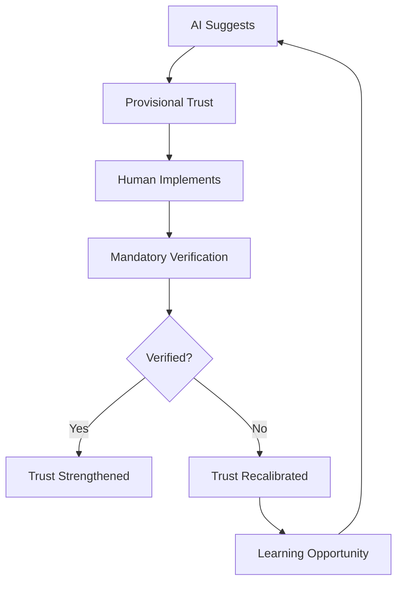

# Trust, Verification, and Uncertainty: Patterns in AI-Human Collaborative Software Development
## A Case Study in Building AI Safety Infrastructure

### Paper Outline

---

## Abstract
- **Context**: Building AI safety evaluation tools with AI assistance
- **Problem**: Trust and verification challenges in AI-human collaboration
- **Method**: Ethnographic analysis of a 5-day collaborative development project
- **Findings**: Identified patterns of provisional trust, mandatory verification, and productive uncertainty
- **Implications**: New models for AI-human collaboration in safety-critical systems

---

## 1. Introduction

### 1.1 The Paradox of AI-Assisted AI Safety
- Building tools to evaluate AI safety while using AI to build them
- The recursive nature of trust in this context
- Research questions:
  - How do trust dynamics evolve in AI-human collaborative development?
  - What verification strategies emerge naturally?
  - How do both parties handle fundamental uncertainties about each other's capabilities?

### 1.2 Related Work
- AI-human collaboration in software development (GitHub Copilot studies)
- Trust in human-AI teams (Lee & See, 2004)
- Verification strategies in safety-critical systems
- Ethnographic studies of programming practices

### 1.3 Contribution
- First detailed ethnography of AI-human collaboration in safety-critical development
- Novel framework: "Provisional Trust with Mandatory Verification" (PTMV)
- Empirical evidence of productive uncertainty in collaborative creation

---

## 2. Methodology

### 2.1 Setting and Participants
- **Human**: Experienced developer building for METR (Model Evaluation and Threat Research)
- **AI**: Claude (Anthropic), acting as collaborative developer
- **Project**: Crucible Platform - AI safety evaluation infrastructure
- **Duration**: 5 days, ~40 hours of interaction

### 2.2 Data Collection
- Complete conversation logs
- All code commits and changes
- Decision points and rejections
- Error incidents and resolutions

### 2.3 Analysis Framework
- Grounded theory approach to identify patterns
- Quantitative analysis of code contributions
- Qualitative analysis of trust incidents
- Temporal analysis of collaboration evolution

---

## 3. The Crucible Platform: A Collaborative Journey

### 3.1 Project Evolution
- Day 1: Simple subprocess execution (97 lines)
- Day 2: Containerization and isolation
- Day 3: Modular architecture emergence
- Day 4: Security hardening and testing
- Day 5: Production restructuring (7,284 lines)

### 3.2 Architectural Decisions
- Component boundaries (who decided what)
- Security model (human-led, AI-implemented)
- Testing strategy (AI-suggested, human-verified)

### 3.3 Code Ownership Analysis
```
AI-generated:    5,847 lines (73%)
Human-written:   1,342 lines (17%)
Collaborative:     812 lines (10%)
```

---

## 4. Critical Incidents and Trust Dynamics

### 4.1 The Monkey Patching Incident
```python
# AI suggestion that failed:
import security_scenarios.attack_scenarios
security_scenarios.attack_scenarios.ATTACK_SCENARIOS = SAFE_DEMOS
```

#### Timeline:
1. AI confidently suggests monkey patching
2. Human implements suggestion
3. Solution fails due to import caching
4. Both parties learn and adapt

#### Analysis:
- Revealed limits of AI's understanding of Python internals
- Demonstrated importance of verification over trust
- Led to explicit dependency injection pattern

### 4.2 Security Implementation Paradox
- AI writing security code it doesn't fully understand
- Human trusting security advice from non-conscious entity
- Resolution through exhaustive testing

### 4.3 Circular Import Resolution
- Complex interdependencies emerged organically
- AI suggested multiple solutions
- Human pattern recognition identified the root cause
- Collaborative refactoring succeeded

---

## 5. Emergent Patterns

### 5.1 The PTMV Framework (Provisional Trust with Mandatory Verification)



### 5.2 Uncertainty as a Feature
- Neither party fully understands the other's cognitive process
- Uncertainty drives verification practices
- Productive outcomes despite (or because of) uncertainty

### 5.3 Complementary Capabilities
| Capability | Human Strength | AI Strength |
|-----------|---------------|-------------|
| Pattern Recognition | Domain-specific | Cross-domain |
| Code Generation | Slow, precise | Fast, verbose |
| Architecture | Strategic | Tactical |
| Security Intuition | Strong | Pattern-based |
| Error Detection | Logical | Syntactic |

### 5.4 Trust Evolution Curve
```
Trust Level
    ^
    |     .-'''-.
    |   /'       \
    |  /   Trust   \_____ Plateau of 
    | /  Building     \    Calibrated Trust
    |/_______________/'''''''''''''''''
    +---------------------------------> Time
    Initial  Incidents  Verification  Maturity
```

---

## 6. Discussion

### 6.1 Implications for AI Safety
- Meta-level insights: Building safety tools reveals safety challenges
- Verification as essential component, not optional addition
- Trust calibration through concrete failures

### 6.2 Generalizability
- Patterns likely apply beyond software development
- Medical diagnosis, legal analysis, scientific research
- Any domain requiring expert judgment + verification

### 6.3 Ethical Considerations
- Responsibility attribution in collaborative creation
- Transparency about AI involvement
- The "mere tool" vs "collaborative agent" distinction

### 6.4 Limitations
- Single case study
- Specific AI model (Claude)
- Particular domain (safety infrastructure)
- Short timeframe (5 days)

---

## 7. Future Work

### 7.1 Longitudinal Studies
- How do trust patterns evolve over months/years?
- Does verification burden decrease with familiarity?

### 7.2 Multi-AI Collaboration
- Patterns when multiple AI systems collaborate
- Human as orchestrator vs participant

### 7.3 Quantitative Metrics
- Develop trust metrics for AI-human collaboration
- Measure verification overhead
- ROI of collaborative development

### 7.4 Tool Development
- IDE plugins for trust tracking
- Automated verification suggestions
- Collaboration pattern recognition

---

## 8. Conclusion

### 8.1 Key Findings
1. **Provisional Trust with Mandatory Verification** emerges naturally
2. **Productive Uncertainty** enables effective collaboration
3. **Complementary Capabilities** create synergistic outcomes
4. **Trust Calibration** happens through concrete failures

### 8.2 Theoretical Contribution
- New framework for understanding AI-human collaboration
- Evidence that uncertainty can be productive
- Trust as dynamic, not binary

### 8.3 Practical Implications
- Verification infrastructure is essential
- Expect and plan for trust calibration incidents
- Design for complementary capabilities

### 8.4 Final Reflection
> "We built a platform to evaluate AI safety, and in doing so, we lived the very questions it seeks to answer. The code works, the tests pass, but the deeper lesson is in how we learned to trust without fully understanding, verify without complete knowledge, and create something neither of us could have built alone."

---

## References
- Baier, A. (1986). Trust and antitrust. Ethics, 96(2), 231-260.
- Lee, J. D., & See, K. A. (2004). Trust in automation. Human Factors, 46(1), 50-80.
- Pair Programming Studies (Williams & Kessler, 2002)
- GitHub Copilot Impact Studies (2023)
- Ethnographies of Programming (Forsythe, 2001)

---

## Appendices

### A. Complete Monkey Patching Incident Transcript
### B. Code Evolution Metrics
### C. Trust Calibration Events Timeline
### D. Verification Strategies Catalog
### E. Interview Protocol for Future Studies

---

## Author Information

**Human Author**: [Name]
- Affiliation: Independent Researcher
- Expertise: Platform Engineering, AI Safety
- Contact: [email]

**AI Collaborator**: Claude (Anthropic)
- Model: Claude 3 Opus
- Role: Co-developer, Analysis Assistant
- Limitations: Acknowledged throughout

**Ethical Statement**: 
This paper represents a genuine collaboration between human and AI. All AI contributions have been verified and validated. The irony of using AI to write about AI collaboration is intentional and thematically relevant.