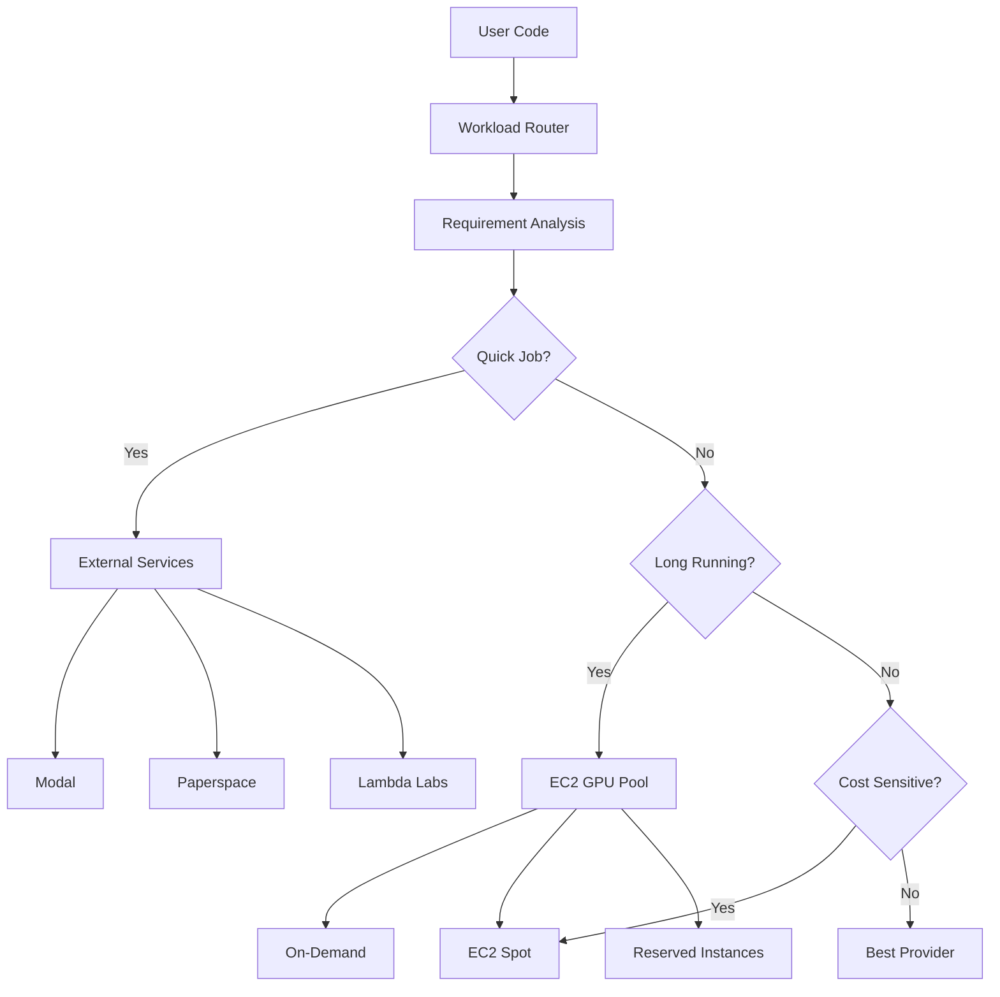

# ML Workload Support: Hybrid Approach (EC2 + External Services)

## Goal: Flexible ML Infrastructure Supporting Both Managed and Self-Hosted GPUs

### Strategy Overview
Provide researchers with choice based on their specific needs:
- **External Services** (Modal, Paperspace, etc.) - Quick experiments, no setup
- **EC2 GPU Instances** - Long runs, full control, cost optimization
- **Smart Routing** - Platform recommends best option based on workload

### Decision Matrix

| Criteria | External Services | EC2 GPU Instances |
|----------|------------------|-------------------|
| **Setup Time** | < 1 minute | 5-10 minutes |
| **Cost (Short Jobs <2hr)** | Lower (pay per second) | Higher (minimum billing) |
| **Cost (Long Jobs >8hr)** | Higher | Lower (especially spot) |
| **GPU Availability** | Usually immediate | May need to wait for spot |
| **Data Privacy** | Shared infrastructure | Dedicated instances |
| **Customization** | Limited | Full control |
| **Persistent Storage** | Provider-specific | EBS/S3 flexible |

## Unified Architecture



## Implementation Plan (7-Day Sprint)

### Day 1: Unified Abstraction Layer

#### Morning: Core Interfaces
```python
from abc import ABC, abstractmethod
from enum import Enum

class ExecutionBackend(Enum):
    MODAL = "modal"
    PAPERSPACE = "paperspace"
    LAMBDA_LABS = "lambda"
    EC2_ONDEMAND = "ec2_ondemand"
    EC2_SPOT = "ec2_spot"
    COLAB = "colab"

class WorkloadCharacteristics:
    duration_hours: float
    gpu_memory_gb: int
    interruptible: bool
    needs_persistent_storage: bool
    dataset_size_gb: float
    checkpoint_frequency: int
    estimated_cost_tolerance: float

class GPUExecutor(ABC):
    @abstractmethod
    async def submit_job(self, code: str, requirements: ResourceRequirements) -> JobHandle
    
    @abstractmethod
    async def estimate_cost(self, characteristics: WorkloadCharacteristics) -> CostEstimate
    
    @abstractmethod
    async def check_availability(self) -> AvailabilityStatus
```

#### Afternoon: Smart Router
```python
class WorkloadRouter:
    def __init__(self):
        self.executors = {
            ExecutionBackend.MODAL: ModalExecutor(),
            ExecutionBackend.EC2_SPOT: EC2SpotExecutor(),
            # ... etc
        }
        
    async def recommend_backend(
        self, 
        code: str,
        user_preferences: UserPreferences
    ) -> List[BackendRecommendation]:
        # Analyze code
        characteristics = await self.analyze_workload(code)
        
        # Score each backend
        recommendations = []
        for backend, executor in self.executors.items():
            score = await self.score_backend(
                backend, 
                characteristics,
                user_preferences
            )
            cost = await executor.estimate_cost(characteristics)
            availability = await executor.check_availability()
            
            recommendations.append(BackendRecommendation(
                backend=backend,
                score=score,
                cost_estimate=cost,
                availability=availability,
                pros=self.get_pros(backend, characteristics),
                cons=self.get_cons(backend, characteristics)
            ))
            
        return sorted(recommendations, key=lambda r: r.score, reverse=True)
```

### Day 2: EC2 GPU Management

#### Morning: Instance Pool Manager
```python
class EC2GPUPool:
    def __init__(self):
        self.ec2 = boto3.client('ec2')
        self.active_instances = {}
        self.spot_requests = {}
        
    async def provision_instance(
        self,
        instance_type: str,
        use_spot: bool
    ) -> EC2Instance:
        if use_spot:
            return await self.request_spot_instance(instance_type)
        else:
            # Check for available pre-warmed instances
            available = self.find_available_instance(instance_type)
            if available:
                return available
            else:
                return await self.launch_on_demand(instance_type)
                
    async def request_spot_instance(self, instance_type: str):
        # Use the terraform-managed launch template
        response = self.ec2.request_spot_instances(
            InstanceCount=1,
            LaunchTemplate={
                'LaunchTemplateName': f'gpu-{instance_type}-template',
                'Version': '$Latest'
            },
            SpotPrice=str(self.get_bid_price(instance_type)),
            Type='one-time'
        )
        
        # Monitor for fulfillment
        request_id = response['SpotInstanceRequests'][0]['SpotInstanceRequestId']
        instance = await self.wait_for_spot_fulfillment(request_id)
        
        # Configure instance
        await self.configure_gpu_instance(instance)
        return instance
```

#### Afternoon: Job Execution on EC2
```python
class EC2JobExecutor:
    async def execute_on_instance(
        self,
        instance: EC2Instance,
        job: MLJob
    ):
        # Copy code to instance
        await self.upload_code(instance, job.code)
        
        # Set up environment
        await self.setup_environment(instance, job.requirements)
        
        # Start execution with monitoring
        docker_cmd = self.build_docker_command(job)
        
        # Use SSM for execution
        ssm = boto3.client('ssm')
        response = ssm.send_command(
            InstanceIds=[instance.id],
            DocumentName='AWS-RunShellScript',
            Parameters={
                'commands': [
                    f'cd /workspace',
                    f'docker run --gpus all {docker_cmd}'
                ]
            }
        )
        
        # Stream logs back
        await self.stream_logs(instance, job.id)
```

### Day 3: External Service Integration

#### Morning: Modal Deep Integration
```python
class ModalExecutor(GPUExecutor):
    def __init__(self):
        self.stub = modal.Stub("crucible-ml")
        
    async def submit_job(self, code: str, requirements: ResourceRequirements):
        # Create optimized Modal function
        gpu_type = self.map_requirements_to_modal_gpu(requirements)
        
        # Build container image with caching
        image = self.get_or_build_image(requirements)
        
        @self.stub.function(
            gpu=gpu_type,
            timeout=requirements.timeout_seconds,
            image=image,
            volumes={
                "/cache": modal.SharedVolume().persist("ml-cache"),
                "/outputs": modal.SharedVolume().persist(f"job-{job_id}")
            }
        )
        async def run_job():
            # Pre-execution setup
            setup_logging(job_id)
            mount_datasets()
            
            # Execute user code
            exec(code, {"__name__": "__main__"})
            
            # Post-execution
            save_artifacts()
            
        # Submit with retry logic
        handle = await run_job.spawn()
        return ModalJobHandle(handle)
```

#### Afternoon: Paperspace Integration
```python
class PaperspaceExecutor(GPUExecutor):
    def __init__(self):
        self.gradient = gradient.JobsClient()
        
    async def submit_job(self, code: str, requirements: ResourceRequirements):
        # Use private cluster for better pricing
        cluster_id = await self.get_or_create_cluster()
        
        # Prepare persistent workspace
        workspace_url = await self.prepare_workspace(code)
        
        job_params = {
            "projectId": self.project_id,
            "clusterId": cluster_id,
            "container": self.select_container(requirements),
            "machineType": self.map_to_gradient_machine(requirements),
            "command": "python /workspace/train.py",
            "workspace": workspace_url,
            "artifactDirectory": "/artifacts",
            "environment": {
                "CRUCIBLE_JOB_ID": job_id,
                "PYTHONUNBUFFERED": "1"
            }
        }
        
        job = await self.gradient.jobs.create(**job_params)
        return PaperspaceJobHandle(job.id)
```

### Day 4: Unified Monitoring & Storage

#### Morning: Cross-Platform Monitoring
```python
class UnifiedJobMonitor:
    def __init__(self):
        self.monitors = {
            ExecutionBackend.EC2_SPOT: EC2Monitor(),
            ExecutionBackend.MODAL: ModalMonitor(),
            ExecutionBackend.PAPERSPACE: PaperspaceMonitor(),
        }
        
    async def get_unified_status(self, job_id: str) -> JobStatus:
        # Get backend-specific status
        backend = await self.get_job_backend(job_id)
        raw_status = await self.monitors[backend].get_status(job_id)
        
        # Normalize to unified format
        return JobStatus(
            id=job_id,
            backend=backend,
            phase=self.normalize_phase(raw_status),
            progress=self.extract_progress(raw_status),
            logs=await self.get_recent_logs(job_id),
            metrics=await self.get_metrics(job_id),
            cost_so_far=await self.calculate_cost(job_id),
            estimated_remaining=self.estimate_remaining_cost(raw_status)
        )
```

#### Afternoon: Unified Storage Layer
```python
class HybridStorage:
    """Handles storage across EC2 and external services"""
    
    async def setup_job_storage(self, job_id: str, backend: ExecutionBackend):
        base_path = f"jobs/{job_id}"
        
        if backend in [ExecutionBackend.EC2_SPOT, ExecutionBackend.EC2_ONDEMAND]:
            # Use EBS + S3 for EC2
            return EC2StorageConfig(
                ebs_volume_id=await self.create_ebs_volume(job_id),
                s3_bucket=self.bucket,
                s3_prefix=base_path
            )
        elif backend == ExecutionBackend.MODAL:
            # Modal SharedVolume + S3 sync
            return ModalStorageConfig(
                shared_volume_name=f"job-{job_id}",
                s3_sync_enabled=True,
                s3_bucket=self.bucket,
                s3_prefix=base_path
            )
        else:
            # Direct S3 for others
            return S3StorageConfig(
                bucket=self.bucket,
                prefix=base_path,
                presigned_urls=await self.generate_urls(base_path)
            )
```

### Day 5: Frontend Integration

#### Morning: Unified Submission UI
```typescript
interface BackendRecommendation {
  backend: ExecutionBackend
  score: number
  costEstimate: {
    hourly: number
    total: number
    confidence: 'high' | 'medium' | 'low'
  }
  availability: {
    status: 'available' | 'queued' | 'limited'
    waitTime?: number
  }
  pros: string[]
  cons: string[]
}

export function MLJobSubmission() {
  const [code, setCode] = useState('')
  const [recommendations, setRecommendations] = useState<BackendRecommendation[]>()
  const [selectedBackend, setSelectedBackend] = useState<ExecutionBackend>()
  
  // Get recommendations as user types
  const { data: recs } = useBackendRecommendations(code)
  
  return (
    <div className="ml-job-submission">
      <CodeEditor value={code} onChange={setCode} />
      
      {recs && (
        <BackendSelector 
          recommendations={recs}
          selected={selectedBackend}
          onSelect={setSelectedBackend}
        />
      )}
      
      {selectedBackend && (
        <BackendDetails 
          backend={selectedBackend}
          code={code}
        />
      )}
    </div>
  )
}
```

#### Afternoon: Cost Comparison Dashboard
```typescript
export function CostComparisonDashboard({ workload }: { workload: Workload }) {
  const costs = useAllBackendCosts(workload)
  
  return (
    <div className="cost-comparison">
      <Chart
        type="bar"
        data={costs}
        title="Estimated Costs by Provider"
      />
      
      <Table>
        <thead>
          <tr>
            <th>Provider</th>
            <th>GPU Type</th>
            <th>$/hour</th>
            <th>Total Est.</th>
            <th>Availability</th>
            <th>Features</th>
          </tr>
        </thead>
        <tbody>
          {costs.map(cost => (
            <ProviderRow key={cost.backend} cost={cost} />
          ))}
        </tbody>
      </Table>
      
      <RecommendationCard recommendation={costs[0]} />
    </div>
  )
}
```

### Day 6: Advanced Features

#### Morning: Hybrid Execution Strategies
```python
class HybridExecutionStrategy:
    """Smart execution across multiple backends"""
    
    async def execute_with_fallback(self, job: MLJob):
        # Try preferred backend first
        primary = self.select_primary_backend(job)
        
        try:
            return await self.executors[primary].submit_job(job)
        except (SpotInstanceTerminated, ProviderQuotaExceeded) as e:
            # Fallback to secondary
            secondary = self.select_fallback_backend(job, failed=primary)
            
            # Transfer any checkpoints
            await self.transfer_checkpoints(job.id, primary, secondary)
            
            # Resume on new backend
            return await self.executors[secondary].submit_job(
                job,
                resume_from_checkpoint=True
            )
    
    async def execute_distributed(self, job: DistributedMLJob):
        """Run different parts on different backends"""
        # Data preprocessing on cheap spot
        preprocess_handle = await self.executors[ExecutionBackend.EC2_SPOT].submit_job(
            job.preprocessing_code,
            requirements=job.preprocessing_requirements
        )
        
        # Training on powerful GPU
        train_handle = await self.executors[ExecutionBackend.MODAL].submit_job(
            job.training_code,
            requirements=job.training_requirements,
            depends_on=preprocess_handle
        )
        
        # Evaluation on multiple backends for comparison
        eval_handles = await asyncio.gather(*[
            self.executors[backend].submit_job(
                job.evaluation_code,
                requirements=job.eval_requirements,
                depends_on=train_handle
            )
            for backend in [ExecutionBackend.LAMBDA_LABS, ExecutionBackend.EC2_ONDEMAND]
        ])
        
        return DistributedJobHandle(preprocess_handle, train_handle, eval_handles)
```

#### Afternoon: Auto-Scaling and Optimization
```python
class AutoScalingManager:
    async def handle_demand_spike(self):
        # Check queue depth
        queue_depth = await self.get_queue_depth()
        
        if queue_depth > self.threshold:
            # Burst to external services
            overflow_jobs = await self.get_overflow_jobs()
            
            for job in overflow_jobs:
                # Route to fastest available external service
                fastest = await self.find_fastest_available()
                await self.executors[fastest].submit_job(job)
        
    async def optimize_long_running_jobs(self):
        # Find jobs suitable for reserved instances
        long_jobs = await self.find_long_running_jobs()
        
        for job in long_jobs:
            if job.estimated_duration > 24 and not job.using_reserved:
                # Migrate to reserved instance for cost savings
                await self.migrate_to_reserved(job)
```

### Day 7: Examples and Documentation

#### Morning: Multi-Backend nanoGPT Example
```python
# example_nanogpt_hybrid.py
"""
Example: Running nanoGPT with automatic backend selection

This example shows how to:
1. Let the platform choose the best backend
2. Handle interruptions gracefully
3. Monitor costs across providers
"""

from crucible import MLPlatform, Requirements

# Initialize platform
platform = MLPlatform()

# Define requirements
requirements = Requirements(
    gpu_memory_gb=16,
    duration_hours_estimated=3,
    checkpoint_frequency_minutes=30,
    interruptible=True,  # Allows spot instances
    max_cost_usd=10.00
)

# Submit with auto-selection
job = platform.submit(
    code=open('nanogpt_train.py').read(),
    requirements=requirements,
    preferences={
        'optimize_for': 'cost',  # or 'speed'
        'allowed_backends': None  # All backends
    }
)

# Monitor across backends
async for status in job.monitor():
    print(f"Backend: {status.backend}")
    print(f"Progress: {status.progress}%")
    print(f"Cost so far: ${status.cost:.2f}")
    
    if status.backend_changed:
        print(f"Migrated from {status.previous_backend} to {status.backend}")
```

#### Afternoon: Comprehensive Documentation
Create guides for:

1. **Backend Selection Guide**
   - Decision flowchart
   - Cost comparison tables
   - Feature matrix

2. **Migration Playbooks**
   - EC2 Spot → External service
   - External service → EC2 Reserved
   - Checkpoint compatibility

3. **Cost Optimization Strategies**
   - Spot instance best practices
   - External service credits/discounts
   - Hybrid execution patterns

4. **Monitoring and Debugging**
   - Unified log aggregation
   - Cross-backend metrics
   - Troubleshooting guide

## Architecture Benefits

### For Researchers
1. **No Infrastructure Knowledge Required** - Platform handles complexity
2. **Cost Transparency** - See costs before running
3. **Flexibility** - Use notebook for exploration, EC2 for production
4. **Reliability** - Automatic fallbacks and migration

### For Platform Team
1. **Cost Control** - Reserved instances for predictable workloads
2. **Burst Capacity** - External services handle spikes
3. **Vendor Independence** - Not locked to any provider
4. **Operational Flexibility** - Can shift workloads based on cost/availability

### Technical Advantages
1. **Unified API** - Same interface regardless of backend
2. **Checkpoint Portability** - Move jobs between backends
3. **Smart Routing** - Optimal backend selection
4. **Cost Optimization** - Automatic selection of cheapest option

## Success Metrics

1. **Researcher Satisfaction**
   - Time to first GPU job: < 5 minutes
   - Job success rate: > 95%
   - Cost vs. manual setup: 20-50% savings

2. **Platform Efficiency**
   - GPU utilization: > 80%
   - Spot instance usage: > 60% of eligible jobs
   - External service burst: < 30% of total

3. **Operational Excellence**
   - Backend failures handled: 100%
   - Checkpoint recovery success: > 90%
   - Cost prediction accuracy: ± 15%

## MVP Implementation (3 days)

### Day 1: Core Router + Modal
- Basic workload analyzer
- Modal integration
- Simple cost estimation

### Day 2: EC2 Spot Integration
- Spot instance launcher
- Basic job execution
- Log streaming

### Day 3: Unified Frontend
- Backend selector UI
- Job submission flow
- Basic monitoring

This gives both flexibility and control while abstracting complexity from researchers!