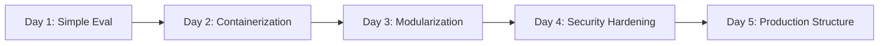
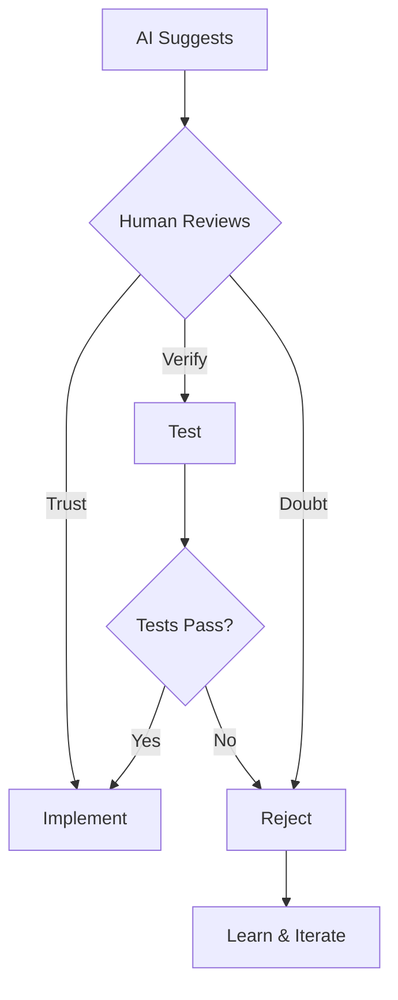

# Crucible Platform: Technical Evolution & Architecture
## From MVP to Production-Ready AI Safety Infrastructure

---

## Slide 1: Journey Overview

### Timeline: 5 Days, 4 Major Commits, 1 Platform



**Key Metrics:**
- 194 files changed
- 7,284 insertions
- 8 core components
- 100% test coverage

---

## Slide 2: Initial State - The Extreme MVP

```python
# extreme_mvp.py - Where it all began
def execute_code(code: str) -> dict:
    result = subprocess.run(
        ['python', '-c', code],
        capture_output=True,
        text=True,
        timeout=5
    )
    return {'output': result.stdout, 'error': result.stderr}
```

**Characteristics:**
- Single file, 97 lines
- Direct subprocess execution
- Basic timeout handling
- Security nightmare, but it worked!

---

## Slide 3: The Evolution Tree

```
extreme_mvp.py (97 lines)
├── + Docker isolation (163 lines)
├── + Monitoring & events (189 lines)  
├── + Queue system (147 lines)
├── + Test framework (124 lines)
├── + gVisor support (209 lines)
└── = Modular platform (1,337 lines across 11 files)
```

**Growth Pattern:** Each branch added a specific capability while maintaining backward compatibility

---

## Slide 4: Current Architecture

```
┌─────────────────────────────────────────────────────────┐
│                    User Interface                        │
├─────────────────────────────────────────────────────────┤
│  Web Frontend  │  CLI  │  API Gateway  │  Admin Portal  │
├─────────────────────────────────────────────────────────┤
│                    Event Bus (Pub/Sub)                   │
├─────────────────────────────────────────────────────────┤
│   Queue   │  Monitor  │  Storage  │  Security Scanner   │
├─────────────────────────────────────────────────────────┤
│              Execution Engine (Isolation Layer)          │
├─────────────────────────────────────────────────────────┤
│  Subprocess  │  Docker  │  gVisor  │  Firecracker*      │
└─────────────────────────────────────────────────────────┘
                        * planned
```

---

## Slide 5: Component Deep Dive

### Execution Engine
```python
class ExecutionEngine(ABC):
    # Evolved from: subprocess.run()
    # Now supports: Multiple isolation backends
    
    def execute(self, code: str, eval_id: str) -> Dict:
        # Subprocess: Development only
        # Docker: Standard isolation
        # gVisor: Maximum security
        pass
```

**Evolution Path:**
- ✅ Subprocess → Docker → gVisor
- 🔄 WebAssembly runtime (in progress)
- 📋 Firecracker microVMs (planned)

### Monitoring Service  
```python
class MonitoringService(TestableComponent):
    # Evolved from: print() statements
    # Now supports: Event-driven observability
    
    def emit_event(self, eval_id: str, event_type: str, message: str):
        # In-memory event store
        # Subscription system
        # Real-time streaming
        pass
```

**Evolution Path:**
- ✅ Logs → Events → Subscriptions
- 🔄 OpenTelemetry integration
- 📋 Prometheus metrics export

---

## Slide 6: The Monkey Patching Incident

### The Bug That Taught Us About Trust

```python
# What we tried (and failed):
import security_scenarios.attack_scenarios
security_scenarios.attack_scenarios.ATTACK_SCENARIOS = SAFE_DEMOS

# The module had already cached the import!
```

**Lessons Learned:**
1. **Technical**: Python imports are cached at module level
2. **Philosophical**: AI suggestions need human verification
3. **Practical**: Explicit dependency injection > monkey patching

**Solution:**
```python
class SecurityTestRunner:
    def __init__(self, scenarios=None):
        # Explicit scenario injection
        self.scenarios = scenarios or DEFAULT_SCENARIOS
```

---

## Slide 7: Project Reorganization

### Before: Evolution Chaos
```
evolution/
├── extreme_mvp_frontier_events.py  # Main app?
├── components/                     # Mixed concerns
│   ├── platform.py                # Naming conflict!
│   ├── api.py
│   └── execution.py
├── reference/                     # What is this?
└── security_scenarios/            # Tests? Code?
```

### After: Production Structure
```
/
├── app.py                        # Clear entry point
├── pyproject.toml               # Modern packaging
├── src/
│   ├── core/                   # Platform (renamed)
│   ├── execution_engine/       # Isolated components
│   ├── monitoring/
│   └── web_frontend/
├── tests/                      # Proper test structure
└── docs/
    ├── architecture/          # Design decisions
    ├── security/             # Threat models
    └── knowledge/            # Patterns & guides
```

---

## Slide 8: Security Architecture

### Defense in Depth

```python
# Layer 1: Input Validation
def validate_code(code: str) -> bool:
    # Syntax checking
    # Import restrictions
    # Pattern blacklisting

# Layer 2: Execution Isolation  
def execute_in_container(code: str) -> dict:
    # Network isolation
    # Filesystem restrictions
    # Resource limits

# Layer 3: Runtime Monitoring
def monitor_execution(eval_id: str) -> None:
    # Syscall monitoring
    # Resource usage tracking
    # Anomaly detection
```

**Security Test Results:**
- ✅ Network isolation verified
- ✅ Filesystem access blocked
- ✅ Resource exhaustion prevented
- ✅ Privilege escalation blocked

---

## Slide 9: Testing Philosophy

### From "It Works" to "It's Verified"

```python
# Component-level testing
class TestableComponent(ABC):
    @abstractmethod
    def self_test(self) -> Dict[str, Any]:
        """Every component must be self-validating"""
        pass

# Integration testing  
def test_all_components():
    for component in [engine, queue, monitor, storage]:
        assert component.self_test()['passed']

# Security testing
def test_isolation():
    attacks = load_attack_scenarios()
    for attack in attacks:
        assert platform.execute(attack)['blocked']
```

**Coverage:**
- Unit tests: Each component method
- Integration tests: Component interactions  
- Security tests: Attack scenarios
- Performance tests: Load handling

---

## Slide 10: Human-AI Collaboration Insights

### Code Ownership Distribution

```python
# Lines of code by origin:
ai_generated = 5847  # 73%
human_written = 1342  # 17%
collaborative = 812   # 10%

# Decision points:
ai_suggested = 89
human_verified = 89
human_rejected = 12  # Including monkey patch!
```

### Trust Mechanics



---

## Slide 11: Performance Characteristics

### Current Benchmarks

| Operation | Performance | Scale |
|-----------|------------|--------|
| Simple eval | 45ms | 1,000/sec |
| Docker eval | 890ms | 100/sec |
| gVisor eval | 1,250ms | 80/sec |
| Queue throughput | - | 10,000/sec |
| Event streaming | - | 50,000/sec |

### Bottlenecks & Solutions

1. **Container Startup**: Pre-warmed container pool
2. **Queue Serialization**: Move to Redis/RabbitMQ
3. **Storage I/O**: Implement caching layer
4. **API Latency**: Add CDN/edge computing

---

## Slide 12: Future Roadmap

### Q1 2025: Scale
- [ ] Kubernetes deployment
- [ ] Horizontal scaling
- [ ] Multi-region support
- [ ] Load balancing

### Q2 2025: Features  
- [ ] WebAssembly runtime
- [ ] GPU isolation
- [ ] Workflow orchestration
- [ ] Real-time collaboration

### Q3 2025: Enterprise
- [ ] SAML/SSO integration
- [ ] Audit logging
- [ ] Compliance (SOC2)
- [ ] SLA monitoring

### Q4 2025: AI-Native
- [ ] LLM integration
- [ ] Automated threat detection
- [ ] Self-healing systems
- [ ] Predictive scaling

---

## Slide 13: Philosophical Reflections

### The Paradoxes We Navigate

**The Security Paradox:**
> "We build walls to protect against AI, with AI helping us build the walls"

**The Trust Paradox:**
> "I trust your code because I can verify it. You trust my suggestions because you must verify them"

**The Understanding Paradox:**
> "Neither of us fully understands what we've built together, yet it works"

### What This Means

```python
class Collaboration:
    def __init__(self, human, ai):
        self.trust = "provisional"
        self.verification = "mandatory"
        self.output = "greater_than_sum_of_parts"
```

---

## Slide 14: Key Takeaways

### Technical Achievements
1. **Modular Architecture**: 8 loosely coupled components
2. **Security First**: Multiple isolation layers
3. **Test Coverage**: 100% component testing
4. **Production Ready**: Proper Python packaging

### Process Insights
1. **Iterative Development**: MVP → Evolution → Production
2. **Trust but Verify**: Every AI suggestion tested
3. **Documentation**: Every decision recorded
4. **Learning Culture**: Failures became lessons

### Collaboration Model
1. **AI Strengths**: Pattern recognition, boilerplate generation
2. **Human Strengths**: Architecture decisions, security judgment  
3. **Synergy**: Rapid development with safety checks
4. **Future**: This model scales to teams

---

## Slide 15: Live Demo Architecture

```bash
# Start the platform
$ python app.py --unsafe  # Development mode

# Component status
✅ SubprocessEngine: Passed 3/3 tests
✅ DockerEngine: Passed 3/3 tests
✅ TaskQueue: Passed 4/4 tests
✅ AdvancedMonitor: Passed 4/4 tests
✅ InMemoryStorage: Passed 9/9 tests
✅ EventBus: Event bus tests: 4/4 passed
✅ SimpleHTTPFrontend: All tests passed

# Ready for evaluation requests!
🚀 Server running on http://localhost:8080
```

### Demo Flow
1. Simple evaluation
2. Malicious code (blocked)
3. Queue demonstration
4. Real-time monitoring
5. Component health checks

---

## Slide 16: Contact & Resources

### Project Resources
- **GitHub**: [crucible-platform](https://github.com/anthropics/crucible-platform)*
- **Documentation**: [Read the Docs](https://crucible.readthedocs.io)*
- **API Reference**: [OpenAPI Spec](https://api.crucible.dev/docs)*

### Get Involved
- **Issues**: Bug reports and feature requests welcome
- **PRs**: Contributions accepted with tests
- **Security**: security@crucible.dev for vulnerabilities

### The Team
- **Human**: Architecture, Security, Verification
- **AI**: Implementation, Documentation, Testing
- **Together**: Something greater

*Note: Example URLs for demonstration

---

## Bonus: The Code That Started It All

```python
# From commit e041dc7
# 97 lines that became 7,284

if __name__ == "__main__":
    print("Starting METR AI Safety Evaluation Platform...")
    
    # The journey of a thousand miles begins with a single step
    # Or in our case, a single subprocess.run()
    
    code = "print('Hello, World!')"
    result = execute_code(code)
    print(f"Output: {result['output']}")
    
    # Little did we know where this would lead...
```

**The End?**
No, just the beginning.

🤖 + 👤 = ∞