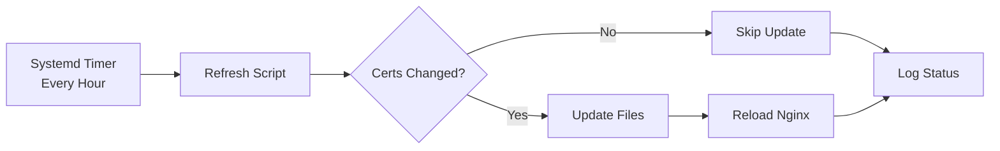

# SSL Certificate Debugging: A Production Engineering Journey

---

## Slide 1: The Innocent Beginning

### "It's Just an SSL Error"

```
Did Not Connect: Potential Security Issue
Firefox detected a potential security threat
```

**What we thought**: Quick SSL fix  
**What it became**: A journey through infrastructure archaeology

---

## Slide 2: The Initial Symptoms

### HSTS Error = Past Success, Current Failure

- ✅ Browser remembers: "This site uses HTTPS"
- ❌ Current state: "Can't establish secure connection"
- 🤔 Question: What changed?

**First Lesson**: HSTS errors tell a story of broken trust

---

## Slide 3: The Architecture

### Our SSL Certificate Design

```
┌─────────────────┐
│   AWS SSM       │  ← Certificates stored securely
└────────┬────────┘
         │
┌────────▼────────┐
│   EC2 Host      │  ← Infrastructure fetches
│ /etc/nginx/ssl/ │
└────────┬────────┘
         │ Bind Mount
┌────────▼────────┐
│ Nginx Container │  ← Application consumes
└─────────────────┘
```

**Design Principle**: Separation of Infrastructure and Application Concerns

---

## Slide 4: The First Red Herring

### Container Permission Errors

```bash
chmod: /etc/nginx/ssl/cert.pem: Read-only file system
```

**What we did**: Refactored nginx entrypoint  
**What we learned**: Containers shouldn't modify infrastructure resources  
**Time spent**: 45 minutes  
**Value gained**: Cleaner architecture ✅

---

## Slide 5: The Real Problem

### Docker Volumes vs Bind Mounts

```yaml
# What we had (❌)
volumes:
  - ssl-certs:/etc/nginx/ssl  # Docker managed volume

# What we needed (✅)
volumes:
  - /etc/nginx/ssl:/etc/nginx/ssl:ro  # Host bind mount
```

**The Realization**: We were looking in two different places!

---

## Slide 6: The Elegant Solution

### Environment-Specific Configurations

```yaml
# Base: No assumptions
docker-compose.yml: # Nothing

# Development: Self-signed
docker-compose.dev.yml:
  volumes: [ssl-certs:/etc/nginx/ssl]

# Production: Infrastructure-managed  
docker-compose.prod.yml:
  volumes: [/etc/nginx/ssl:/etc/nginx/ssl:ro]
```

**Principle**: Make invalid configurations impossible

---

## Slide 7: The Plot Thickens

### Certificate Domain Mismatch

```
What we had:
  CN = crucible.veylan.dev
  DNS: crucible.veylan.dev, www.crucible.veylan.dev

What we accessed:
  green.crucible.veylan.dev ❌

What we needed:
  CN = *.crucible.veylan.dev ✅
```

**Discovery**: Right certificate in AWS, wrong certificate on host

---

## Slide 8: The Automation Solution

### Systemd Timer Architecture



**Features**:
- Runs immediately on boot
- Hourly refresh thereafter
- Only reloads when needed
- Graceful nginx reload

---

## Slide 9: The Hidden State

### The Terraform Surprise

```hcl
user_data_replace_on_change = false  # 😱
```

**The Mystery**: Why weren't instances updating?  
**The Answer**: A setting from months ago  
**The Lesson**: State hides in unexpected places

---

## Slide 10: Debugging Psychology

### The Emotional Journey

1. **Confidence**: "Just an SSL error" ⚡
2. **Confusion**: "But the certs are there..." 🤔
3. **Frustration**: "We are SO CLOSE" 😤
4. **Revelation**: "Oh, it's user_data_replace" 💡
5. **Satisfaction**: "Everything makes sense now" 😌

**Key Insight**: Frustration often signals hidden state

---

## Slide 11: Engineering Principles Demonstrated

### What This Journey Taught Us

1. **Explicit > Implicit**
   - Always specify critical behaviors
   - Document non-obvious configurations

2. **Separation of Concerns**
   - Infrastructure manages certificates
   - Applications consume certificates

3. **Observability First**
   - Log at decision points
   - Make debugging possible

4. **Immutable Infrastructure**
   - Replace, don't patch
   - State changes require new resources

---

## Slide 12: The Kubernetes Future

### Evolution of Certificate Management

```
Docker Compose Era:
- Manual → Automated (systemd)
- Host-based certificate management
- Bind mounts for sharing

Kubernetes Era:
- Cert-Manager operators
- Kubernetes Secrets
- Automated rotation
- No host dependencies
```

**Same Principle**: Infrastructure handles certificates

---

## Slide 13: Levels of State

### Where State Hides in Modern Systems

1. **Cloud Provider**: AWS SSM Parameters
2. **IaC Tool**: Terraform state file  
3. **Instance**: Userdata execution
4. **OS**: Systemd timers
5. **Container Runtime**: Volume mounts
6. **Application**: Nginx configuration
7. **Browser**: HSTS cache

**Debugging Requirement**: Understand all layers

---

## Slide 14: The Cost of Configuration

### Small Details, Big Impact

```yaml
# 34 characters that broke production
- ssl-certs:/etc/nginx/ssl

# 3 words that prevented updates  
user_data_replace_on_change = false

# 1 underscore that accepts any domain
server_name _;
```

**Lesson**: In distributed systems, configuration is code

---

## Slide 15: Communication Challenges

### The Human Interface

**The Problem**: Multi-line commands in chat
```bash
aws ssm get-parameter \
  --name "/crucible-platform/ssl/certificate" \
  --with-decryption \
  --region us-west-2
```

**The Solution**: Single-line commands
```bash
aws ssm get-parameter --name "/crucible-platform/ssl/certificate" --with-decryption --region us-west-2
```

**Lesson**: UX matters, even in DevOps

---

## Slide 16: Architectural Decisions

### Why Infrastructure Owns Certificates

**Option 1**: Containers fetch certificates
- ❌ Requires AWS credentials in containers
- ❌ Increases attack surface
- ❌ Complicates container images

**Option 2**: Infrastructure provides certificates
- ✅ Clear security boundary
- ✅ Containers remain stateless
- ✅ Works across platforms (Docker/K8s)

**Winner**: Option 2 - Separation of concerns

---

## Slide 17: The Debugging Methodology

### How We Solved It

1. **Verify Symptoms**: HSTS error confirmed
2. **Check Obvious**: Nginx logs, port 443
3. **Test Inside-Out**: Container → Host → Internet
4. **Question Assumptions**: Volume types matter
5. **Check State**: Terraform, SSM, filesystem
6. **Find Root Cause**: Configuration mismatch
7. **Design Solution**: Automated refresh
8. **Document Journey**: This presentation

---

## Slide 18: Time Investment

### Where We Spent Our Time

```
Initial Diagnosis:        20 min
Permission Debugging:     45 min  ← Red herring
Volume Discovery:         30 min  ← Breakthrough
Certificate Analysis:     25 min
Automation Design:        40 min
Terraform State Debug:    35 min  ← Hidden state
Documentation:           60 min  ← Multiplier effect
─────────────────────────────────
Total:                   4 hours
```

**ROI**: Automated system + Knowledge captured

---

## Slide 19: Broader Implications

### This Wasn't Just About SSL

It was about:
- **System Design**: How components interact
- **State Management**: Where configuration lives
- **Human Factors**: Frustration as a debugging signal
- **Evolution**: From manual to automated systems
- **Documentation**: Capturing the why, not just the what

---

## Slide 20: Key Takeaways

### For Your Next Debugging Adventure

1. **HSTS errors mean past success**
2. **Check volume mount types**
3. **Verify certificate domains match**
4. **Look for hidden state in IaC tools**
5. **Automate repetitive fixes**
6. **Document the journey**
7. **Frustration indicates hidden assumptions**

---

## Slide 21: The Happy Ending

### What We Achieved

✅ SSL certificates working correctly  
✅ Automated hourly refresh  
✅ Environment-specific configurations  
✅ Clear architectural boundaries  
✅ Prepared for Kubernetes migration  
✅ Knowledge documented for the future  

🎉 **green.crucible.veylan.dev is live!**

---

## Slide 22: Questions for Discussion

### Reflecting on the Journey

1. **What hidden state exists in your systems?**
2. **Where do you draw infrastructure/application boundaries?**
3. **How do you handle environment-specific configurations?**
4. **What debugging frustrations have revealed deeper issues?**
5. **How do you capture institutional knowledge?**

---

## Slide 23: Engineering Philosophy

### Final Thoughts

> "In distributed systems, the bug is never where you think it is,  
> but it's always exactly where it should be once you find it."

**The Paradox**: Complex bugs have simple causes, hidden by layers of abstraction

**The Solution**: Patient, methodical investigation through each layer

**The Reward**: Systems that work, and knowledge that lasts

---

## Bonus Slide: The Command Line UX

### A Moment of Empathy

**Developer**: "Here's the fix!" *[sends multi-line command]*

**Operator**: "no, no, no"

**Lesson**: Even in 2025, copy-paste ergonomics matter

Sometimes the most important engineering skill is remembering that humans use our tools.