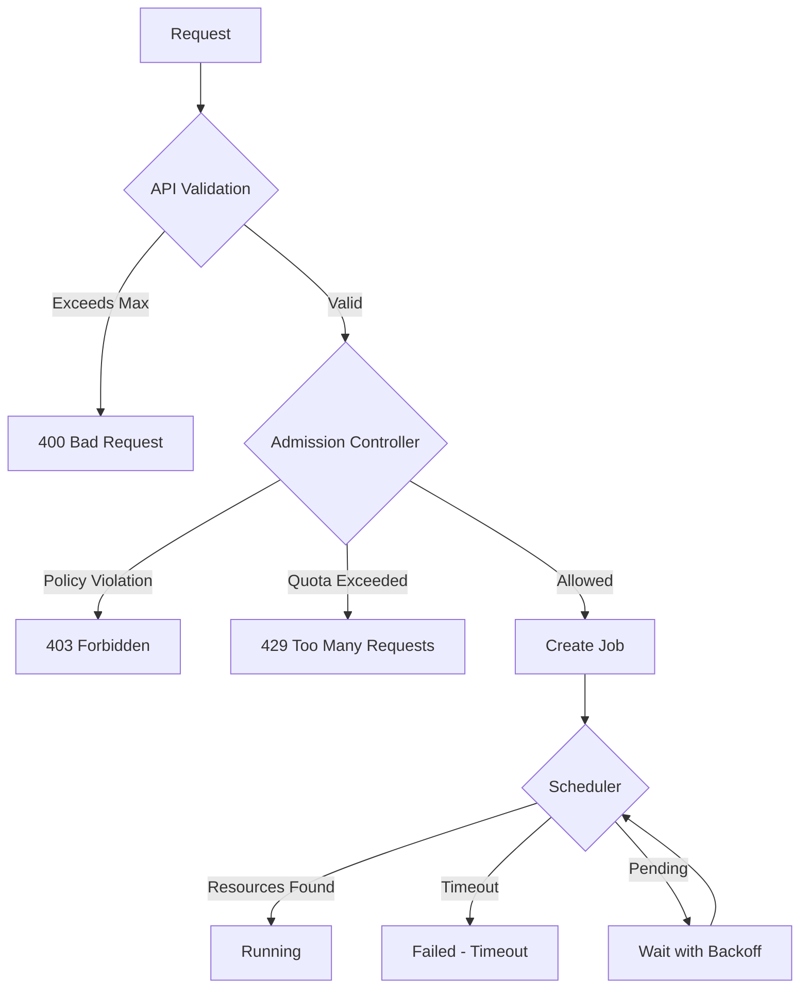

# Resource Validation Patterns for Kubernetes Workloads

## Overview

For high-standard professional systems, resource validation should follow a three-tier approach that balances fast failure for impossible requests with flexibility for the scheduler to optimize resource allocation.

## Three-Tier Validation Approach

### 1. API-Level Validation (Immediate Rejection)

Reject obviously impossible requests at the API layer for fast user feedback:

```python
def validate_request(request):
    # Static cluster limits
    if request.memory > CLUSTER_MAX_MEMORY_WITH_SCALING:
        return 400, "Exceeds maximum cluster capacity even with scaling"
    
    # Node-level constraints (can't scale beyond largest possible node)
    if request.memory > MAX_NODE_MEMORY:
        return 400, "No node type can satisfy this memory request"
    
    # Per-job policy limits
    if request.cpu > MAX_ALLOWED_CPU_PER_JOB:
        return 400, "Requested CPU exceeds per-job limit"
    
    # Scaling limits
    max_possible_nodes = min(
        AUTOSCALING_MAX_NODES,
        CLOUD_ACCOUNT_INSTANCE_LIMIT,
        BUDGET_LIMIT_IN_NODES
    )
    max_possible_resources = max_possible_nodes * MAX_NODE_RESOURCES
    
    if request.cpu > max_possible_resources.cpu:
        return 400, f"Exceeds maximum possible CPU even with {max_possible_nodes} nodes"
```

### 2. Admission Controller (Policy Enforcement)

Use Kubernetes ValidatingAdmissionWebhook or similar for dynamic policy enforcement:

```python
def admit_job(request, current_state):
    # Reject based on current state + policies
    if request.memory > current_state.largest_node_memory:
        return 400, "No node can satisfy this request"
    
    # User quota enforcement
    if request.user.current_usage + request.memory > request.user.quota:
        return 403, "User quota exceeded"
    
    # Priority-based admission
    if current_state.is_at_capacity and request.priority < MINIMUM_PRIORITY:
        return 429, "Cluster at capacity, only high-priority jobs accepted"
```

### 3. Scheduler-Level (Queue with Timeout)

Let the scheduler attempt to find resources, but with reasonable bounds:

```python
# Let scheduler try, but with bounds
create_job(
    request,
    scheduling_timeout=300,  # 5 minutes to find resources
    annotations={
        "cluster-autoscaler.kubernetes.io/safe-to-evict": "false",
        "scheduler.alpha.kubernetes.io/preferred-node-selector-terms": "..."
    }
)
```

## Key Principles

1. **Fail fast on impossible** - Don't queue requests that can never succeed
2. **Queue on possible** - Let the scheduler try for requests that might succeed with scaling/reshuffling  
3. **Bounded waiting** - Don't let requests wait forever (use activeDeadlineSeconds)
4. **Clear rejection reasons** - Users need actionable error messages

## Industry Patterns

### What Different Systems Do

- **Databricks/Spark**: Rejects if request exceeds largest possible executor size
- **Kubernetes Jobs**: Queues until resources available (no upper bound by default)
- **Slurm/HPC**: Rejects if exceeds queue limits, queues otherwise
- **AWS Batch**: Queues with optional timeout, auto-scales to configured limits
- **Google Cloud Run**: Rejects if exceeds maximum instance size, scales within bounds

### Different Scaling Scenarios to Validate

1. **Physical limits**: Largest instance type available in your cloud/cluster
2. **Policy limits**: Maximum nodes allowed by autoscaling configuration  
3. **Budget limits**: Maximum spend allowed (nodes × cost_per_hour × max_hours)
4. **Quota limits**: Cloud provider service quotas (e.g., vCPU limits)

## Implementation Recommendations

### Configuration Service Pattern

Maintain a configuration service that tracks:
- Current capacity
- Maximum scalable capacity  
- Available instance types
- Scaling policies
- Budget constraints

```python
class ClusterCapacityService:
    def get_limits(self):
        return {
            "current": {
                "cpu": "48 cores",
                "memory": "192Gi",
                "gpu": "4"
            },
            "maximum_with_scaling": {
                "cpu": "480 cores",  # 10 nodes × 48 cores
                "memory": "1920Gi",
                "gpu": "40"
            },
            "per_job_limits": {
                "cpu": "48 cores",   # Single node maximum
                "memory": "192Gi",
                "gpu": "8"
            }
        }
```

### Validation Flow



## Best Practices

1. **Sync Limits with Reality**: Keep validation limits in sync with actual cluster configuration
2. **Provide Alternatives**: When rejecting, suggest what would work (e.g., "Maximum allowed: 4Gi")
3. **Monitor Rejections**: Track what gets rejected to understand user needs
4. **Grace Periods**: Allow slight overages for trusted users/high-priority work
5. **Clear Documentation**: Document all limits and how they're calculated

## Example Error Messages

Good error messages help users adjust their requests:

```json
{
  "error": "Resource limit exceeded",
  "detail": "Requested memory (1000Gi) exceeds maximum cluster capacity (256Gi)",
  "suggestion": "Maximum allowed memory per job is 64Gi",
  "documentation": "https://docs.example.com/resource-limits"
}
```

## Testing Resource Validation

Test cases should cover:
1. Requests within all limits (should succeed)
2. Requests exceeding per-job limits (should fail fast)
3. Requests exceeding cluster capacity (should fail fast)
4. Requests that would require scaling (should queue)
5. Requests during resource pressure (should queue or fail based on priority)

## Future Considerations

- **Predictive Rejection**: Use historical data to predict if a job will likely timeout
- **Resource Negotiation**: Allow jobs to specify min/max resources and let system choose
- **Spot/Preemptible Handling**: Different validation for jobs that can handle interruption
- **Cost-Based Validation**: Reject based on estimated cost, not just resources