## Journey Overview: Each Step Driven by a Problem

```mermaid
graph LR
    A[Day 1: Extreme MVP] -->|"PROBLEM: No isolation!"| B[Day 2: Containerization]
    B -->|"PROBLEM: Monolithic code"| C[Day 3: Modularization]
    C -->|"PROBLEM: Still unsafe"| D[Day 4: Security Hardening]
    D -->|"PROBLEM: MVP chaos"| E[Day 5: Production Structure]
    E -->|"PROBLEM: Manual deployment"| F[Day 6: Infrastructure as Code]
    F -->|"PROBLEM: Limited access"| G[Day 7: SSH Tunneling]
    G -->|"PROBLEM: Not scalable"| H[Next: Kubernetes]
```

---

## Current State: Production on AWS

**What We've Achieved:**

- ✅ Full stack deployed on EC2 with Docker Compose
- ✅ Blue-green deployment with zero downtime
- ✅ PostgreSQL for persistent storage
- ✅ React frontend with real-time monitoring
- ✅ Secure code execution with gVisor
- ✅ CI/CD pipeline with GitHub Actions
- ✅ Infrastructure as Code with Terraform

**Live Demo Available!**
